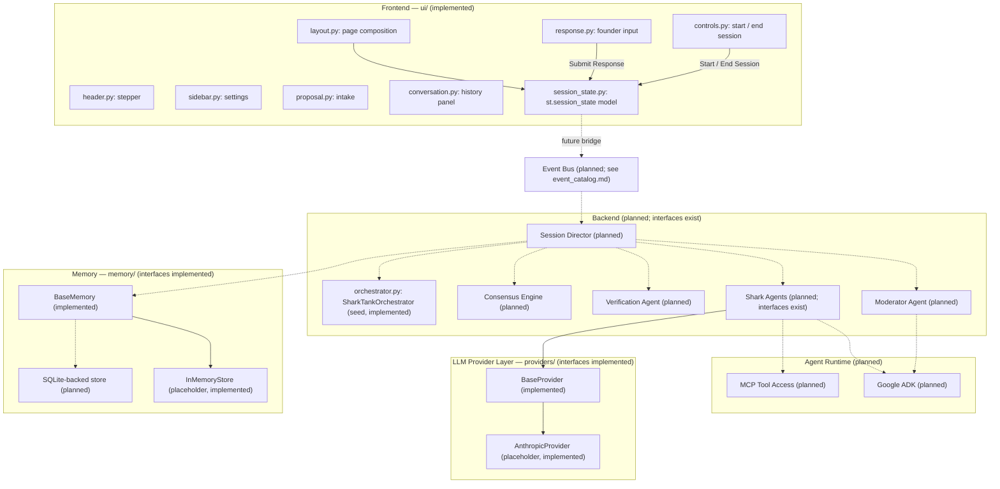

# Architecture

**Status:** Official architecture, locked as of Release 0.3.5. Future
releases must build toward what's described here; this document is
not aspirational marketing copy — every claim below is either backed
by code that exists today or explicitly marked as planned.

**Status legend used throughout this document:**

- ✅ **Implemented** — exists in the codebase today.
- 🧭 **Planned** — part of the target architecture, not yet built.
- ⚠️ **Known gap** — an inconsistency between current pieces that a
  future release must resolve.

This document assumes familiarity with the companion documents:
[`folder_structure.md`](folder_structure.md) (what each folder owns),
[`state_machines.md`](state_machines.md) (the two state machines
referenced below), [`event_catalog.md`](event_catalog.md) (the Event
Bus message vocabulary), [`agent_contract.md`](agent_contract.md) (the
interface every agent must implement), and
[`coding_standards.md`](coding_standards.md) (how code implementing
any of this must be written).

---

## Project Vision

Shark Tank AI is a turn-based, multi-agent Streamlit application. A
founder submits a startup proposal; an AI investment committee — a
Moderator and three Shark Agents, each embodying a distinct venture
capital investment *philosophy* (Conservative, Growth, and Balanced)
rather than a domain specialty — questions the founder, deliberates
internally without the founder present, verifies its own reasoning,
reaches consensus, and delivers a single investment decision. The
founder then resets to begin an entirely new session.

> **Design history:** Prior to Release 0.3.7, the committee was five
> Shark Agents distinguished by domain specialty (Growth, Financial,
> Technical, Marketing, Risk Investor). That design was abandoned in
> favor of three philosophy-based Sharks, each evaluating the entire
> business rather than a slice of it. See
> [`docs/agent_personas.md`](agent_personas.md) for the current
> persona specification and the rationale for the change.

This is explicitly **not** a chatbot. There is no free-form back and
forth with a single assistant. The experience has a beginning, a
middle, and an end, and it is designed around that shape: a visible
session progress stepper, a read-only turn-based conversation history,
and a single gated response control rather than an open chat box.

## Overall Architecture

Solid arrows exist in code today. Dashed arrows are planned
connections described elsewhere in this document.

## Frontend

**Status: Implemented.**

The frontend lives entirely in `ui/`, composed by `ui/layout.py`, and
is driven by a single, centrally-defined session state model in
`ui/session_state.py`. No component invents its own state key — every
read and write goes through the keys defined there
(`current_phase`, `conversation_history`, `selected_provider`,
`proposal_uploaded`, `user_input_enabled`, `session_running`, and the
rest).

Each visual area is its own module: `header.py` (title, subtitle, and
the progress stepper), `sidebar.py` (Settings), `proposal.py` (the
Startup Proposal intake panel and Session Stage card),
`conversation.py` (the turn-based history panel), `response.py` (the
single founder response control), and `controls.py` (the sticky
bottom bar with Start Session / End Session). `styles.py` injects the
shared CSS once.

The frontend currently talks only to `st.session_state` — it has no
dependency on `orchestrator/`, `agents/`, or `providers/`. This is
intentional: it lets the entire UI be built and verified before any
backend logic exists, and it defines the seam where the future Event
Bus will attach (see **Event Bus** below).

## Backend

**Status: Planned. Interfaces exist; behavior does not.**

"Backend" here means everything that decides what the committee says
and does: `agents/`, `orchestrator/`, `providers/`, `memory/`,
`prompts/`, and the domain models in `models/schemas.py`. Every class
in these packages exists as an abstract interface or a placeholder
concrete class whose methods raise `NotImplementedError`
(`BaseAgent.evaluate_pitch`, `SharkTankOrchestrator.run_pitch`,
`BaseProvider.generate`, `BaseMemory.save`/`load`/`history`/`clear`).
This is deliberate scaffolding from Release 0.1–0.3, not an oversight.

The sections below describe each backend concept the way it must be
built when a future release implements it.

## Google ADK

**Status: Planned. No integration exists today.**

The Google Agent Development Kit is the intended runtime for
executing Moderator and Shark Agents: it standardizes agent lifecycle
management, tool invocation, and structured multi-turn execution.
When integrated, ADK must sit *behind* the existing `BaseAgent`
interface (see [`agent_contract.md`](agent_contract.md)) — agents
built on ADK should be indistinguishable, from the orchestrator's
point of view, from any other `BaseAgent` implementation. No code in
this repository references ADK yet.

## MCP

**Status: Planned. No integration exists today.**

The Model Context Protocol is the intended mechanism for giving agents
standardized access to external tools and data sources (for example, a
market-data lookup or a financial-ratios calculator) without hardcoding
provider-specific tool-calling logic into each agent. MCP access, once
implemented, is expected to be exposed through the same
`providers/`-level abstraction that LLM calls go through today, so
agents request a capability rather than a specific MCP server. No new
top-level folder is committed to for this; the concrete home (extending
`providers/` vs. a narrowly-scoped new module) is a decision for the
release that implements it.

## Session Director

**Status: Planned. `orchestrator/orchestrator.py` is its seed.**

The Session Director is the central coordinator that drives the **User
Session State Machine** (see [`state_machines.md`](state_machines.md))
forward: it decides when validation happens, when the Question Round
starts, when to hand off to the Moderator, when to invoke Verification
and the Consensus Engine, and when to publish
`InvestmentDecisionMade`. `SharkTankOrchestrator` in
`orchestrator/orchestrator.py` already exists as the class this
responsibility will grow into (`run_pitch()` currently raises
`NotImplementedError`), but it does not yet drive any state machine or
publish any events.

## Moderator Agent

**Status: Planned. Its speaker identity is already modeled today.**

The Moderator facilitates turn-taking: announcing phase transitions,
asking the founder clarifying questions on the committee's behalf, and
narrating what's happening while the committee deliberates internally.
`SpeakerRole.MODERATOR` already exists in `models/enums.py` and is
rendered with its own distinct style in `ui/conversation.py` — the
example seed transcript already includes a Moderator message. No
agent produces Moderator messages yet; today they are static example
content.

## Shark Agents

**Status: Planned. Personas and interfaces are already modeled today.**

Three investor roles, each a distinct venture capital investment
philosophy rather than a domain specialty, are first-class values of
`SpeakerRole`: Conservative VC, Growth VC, and Balanced VC — each with
its own color-coded rendering in `ui/conversation.py`. Every Shark
evaluates the whole business (business model, market, competition,
technology, founder, execution, financials, valuation, operations,
growth, competitive advantage, and risk); what differs between them is
how each weighs those factors, not which of them each one looks at.
See [`docs/agent_personas.md`](agent_personas.md) for the full
specification, including Dynamic Industry Adaptation — how a Shark
adapts its reasoning to a pitch's business domain without changing its
underlying philosophy.

`agents/base_agent.py` defines `BaseAgent`, and `agents/shark_agent.py`
defines the placeholder `SharkAgent` class, which will use a
`SharkPersona` (`models/schemas.py`), a `BaseProvider` implementation,
and a persona-specific prompt template from `prompts/` to produce an
`Offer`. None of this is wired up yet —
`SharkAgent.evaluate_pitch()` raises `NotImplementedError`.

## Verification Agent

**Status: Planned. No interface exists today.**

The Verification Agent checks the committee's internal deliberation
for consistency and soundness before Consensus begins — it corresponds
directly to the `VERIFICATION` phase already modeled in
`SessionPhase`. No `VerificationAgent` class exists yet; when it does,
it must implement the same contract defined in
[`agent_contract.md`](agent_contract.md) as every other agent, so the
Session Director can treat it uniformly.

## Consensus Engine

**Status: Planned. No interface exists today.**

The Consensus Engine aggregates the Shark Agents' individual
positions — offers, rejections, and conditions — into the single
`InvestmentDecisionMade` outcome, corresponding to the `CONSENSUS` and
`INVESTMENT_DECISION` phases. It is expected to live alongside the
Session Director in `orchestrator/`, operating on the `Offer` and
`NegotiationSession` models already defined in `models/schemas.py`.
No implementation exists yet.

## Memory

**Status: Interfaces implemented; storage behavior planned.**

`memory/base_memory.py` defines `BaseMemory` (`save`, `load`,
`history`, `clear`), and `memory/in_memory_store.py` defines the
placeholder `InMemoryStore` — both exist today, and both raise
`NotImplementedError` on every method. `config/settings.py` already
exposes `memory_backend` (default `"in-memory"`) and `database_url`
(default `sqlite:///./data/app.db`), anticipating the SQLite-backed
implementation described next.

## SQLite

**Status: Planned.**

SQLite is the target persistent backend for conversation history,
session snapshots, and negotiation outcomes surviving process
restarts — the production alternative to the ephemeral
`InMemoryStore`. `Settings.database_url` already defaults to a SQLite
connection string, but no `BaseMemory` implementation backed by
SQLite exists in the codebase yet.

## LLM Provider Layer

**Status: Interfaces implemented; integrations planned. Known gap below.**

`providers/base_provider.py` defines `BaseProvider` (a `generate()`
method plus an `is_configured` property), and
`providers/anthropic_provider.py` defines the placeholder
`AnthropicProvider` — both exist today; `generate()` raises
`NotImplementedError`.

> **Known gap:** `ui/sidebar.py` already lets the user select
> **Gemini** or **Ollama** as the active provider, and
> `config/settings.py` defines `anthropic_api_key` and
> `openai_api_key` fields — but no `GeminiProvider` or
> `OllamaProvider` class exists, and no corresponding `gemini_api_key`
> settings field is wired to a provider implementation. The sidebar
> fields are UI-only placeholders (Release 0.3 explicitly scoped out
> LLM calls). A future release must either implement matching
> provider classes for Gemini and Ollama, or reconcile the sidebar's
> options with whatever providers actually exist. This gap is
> recorded here so it isn't mistaken for a design decision.

## Event Bus

**Status: Planned. No publish/subscribe mechanism exists today.**

No Event Bus, message queue, or observer pattern exists anywhere in
the codebase yet. [`event_catalog.md`](event_catalog.md) defines the
complete planned message vocabulary — every topic, its publisher, its
subscribers, and its payload shape — that any future Event Bus
implementation must satisfy. The frontend's current direct
`st.session_state` mutations (e.g., `ui/controls.py` setting
`session_running` and `current_phase` on a button click) are the
seam that will eventually be replaced by publishing and subscribing to
these events instead.

## State Machines

**Status: User Session phases modeled; Agent Orchestration state planned.**

`models/enums.py::SessionPhase` already implements all nine phases of
the **User Session State Machine** and actively drives
`ui/header.py`'s progress stepper and `ui/proposal.py`'s Session Stage
card. The **Agent Orchestration State Machine** — governing how a
single agent task moves from `Waiting` through `Completed`/`Failed` —
is not implemented in any form; it is defined for the first time in
[`state_machines.md`](state_machines.md) as a contract, not a
retrofit of existing code.

## Agent Skills

**Status: Planned. No implementation exists today.**

A "skill" is a bounded, named, reusable capability an agent can invoke
(for example, `valuation_estimation` or `risk_flagging`) that is
distinct from an unstructured LLM call — it has a defined input shape,
output shape, and failure mode. No skill system exists yet;
[`agent_contract.md`](agent_contract.md) defines how agents must
declare and access skills once they exist.

## Progressive Disclosure

**Status: Design principle; partially reflected in the UI today.**

The UI should reveal only what's relevant to the founder at the
current phase, and keep advanced or diagnostic information behind
explicit opt-in controls. `ui/sidebar.py` already reflects this today:
Verbose Mode and Developer Mode are opt-in toggles, and "Show
Reasoning" exists as a visibly disabled control rather than being
hidden entirely — signaling that it's coming without exposing anything
yet. Future phases (deliberation detail, verification traces,
consensus rationale) must follow the same principle: summarized by
default, with detail available only on request. See
[`coding_standards.md`](coding_standards.md) → *Session State* for how
this should be implemented.

## Future Extension Points

This section exists so future releases have an explicit, agreed-upon
list of where new functionality is expected to attach, rather than
each release inventing its own integration points:

1. **`ui/session_state.py` → Event Bus bridge.** The point where
   direct session-state mutation (today) is replaced by publishing
   events and reacting to subscribed events (future).
2. **`orchestrator/orchestrator.py` → Session Director + Consensus
   Engine.** `SharkTankOrchestrator` is the seed both responsibilities
   will grow from or alongside.
3. **`agents/` → Verification Agent.** A new agent class implementing
   the contract in `agent_contract.md`, parallel to `SharkAgent`.
4. **`providers/` → Gemini/Ollama/ADK/MCP.** New provider
   implementations closing the known gap above, plus the eventual home
   for ADK-managed execution and MCP tool access.
5. **`memory/` → SQLite-backed store.** A new concrete `BaseMemory`
   implementation alongside `InMemoryStore`, selected via the existing
   `memory_backend` setting.
6. **`prompts/` → Verification and Consensus prompt templates.**
   Additional `.txt` templates alongside the existing three, following
   the same `prompts/loader.py` convention.

No new top-level folders are introduced by this document. Any future
release that needs one must update
[`folder_structure.md`](folder_structure.md) explicitly rather than
letting one appear implicitly.
