# Architecture

**Status:** Official architecture, locked as of Release 0.3.5. Future
releases must build toward what's described here; this document is
not aspirational marketing copy — every claim below is either backed
by code that exists today or explicitly marked as planned. Per-section
status markers are kept current as each release ships (most recently
updated for Release 0.4); the overall architecture itself remains
locked.

**Status legend used throughout this document:**

- ✅ **Implemented** — exists in the codebase today.
- 🧭 **Planned** — part of the target architecture, not yet built.
- ⚠️ **Known gap** — an inconsistency between current pieces that a
  future release must resolve.

This document assumes familiarity with the companion documents:
[`folder_structure.md`](folder_structure.md) (what each folder owns),
[`state_machines.md`](state_machines.md) (the two state machines
referenced below), [`event_catalog.md`](event_catalog.md) (the Event
Bus message vocabulary), [`agent_contract.md`](agent_contract.md) (the
interface every agent must implement), and
[`coding_standards.md`](coding_standards.md) (how code implementing
any of this must be written).

---

## Project Vision

Shark Tank AI is a turn-based, multi-agent Streamlit application. A
founder submits a startup proposal; an AI investment committee — a
Moderator and three Shark Agents, each embodying a distinct venture
capital investment *philosophy* (Conservative, Growth, and Balanced)
rather than a domain specialty — questions the founder, deliberates
internally without the founder present, verifies its own reasoning,
reaches consensus, and delivers a single investment decision. The
founder then resets to begin an entirely new session.

> **Design history:** Prior to Release 0.3.7, the committee was five
> Shark Agents distinguished by domain specialty (Growth, Financial,
> Technical, Marketing, Risk Investor). That design was abandoned in
> favor of three philosophy-based Sharks, each evaluating the entire
> business rather than a slice of it. See
> [`docs/agent_personas.md`](agent_personas.md) for the current
> persona specification and the rationale for the change.

This is explicitly **not** a free-form chatbot: there is no open-ended
back and forth with a single assistant, and the founder can never
speak out of turn. The experience has a beginning, a middle, and an
end, and it is designed around that shape: a visible session progress
stepper, a turn-based conversation history, and a single gated
response control. As of Release 0.4.1, that conversation history and
response control are rendered with Streamlit's native chat components
(`st.chat_message`, `st.chat_input`) rather than custom-styled
`
`s and a text area — see *Chat UI* below — but the interaction
model underneath is unchanged: it is a strictly turn-gated
conversation with a Moderator and three Sharks, not an open chat box.

## Overall Architecture

```mermaid
flowchart TB
    subgraph Frontend["Frontend — ui/ (implemented)"]
        Layout["layout.py: page composition"]
        Header["header.py: stepper"]
        Sidebar["sidebar.py: settings"]
        Proposal["proposal.py: intake"]
        Conversation["conversation.py: history panel"]
        Response["response.py: founder input"]
        Controls["controls.py: start / end session"]
        SessionState["session_state.py: st.session_state model"]
    end

    subgraph Backend["Backend (Session Director + Shark intelligence implemented; Verification/Consensus still planned)"]
        SessionDirector["Session Director — orchestrator.py: SharkTankOrchestrator (implemented)"]
        Moderator["Moderator Agent (deterministic narration implemented)"]
        Sharks["Shark Agents (ask_question/evaluate_pitch/deliberate implemented, real LLM calls)"]
        Verification["Verification Agent (planned; deterministic pass-through today)"]
        Consensus["Consensus Engine (planned; deterministic placeholder today)"]
        TurnController["turn_controller.py: TurnController (implemented)"]
    end

    subgraph Runtime["Agent Runtime (planned)"]
        ADK["Google ADK (planned)"]
        MCP["MCP Tool Access (planned)"]
    end

    subgraph Providers["LLM Provider Layer — providers/ (Anthropic implemented)"]
        BaseProvider["BaseProvider (implemented)"]
        Anthropic["AnthropicProvider (implemented, real anthropic SDK calls)"]
    end

    subgraph Memory["Memory — memory/ (interfaces implemented)"]
        BaseMemory["BaseMemory (implemented)"]
        InMemory["InMemoryStore (placeholder, implemented)"]
        SQLite["SQLite-backed store (planned)"]
    end

    EventBus["Event Bus — event_bus.py: EventBus (minimal sync implementation; see event_catalog.md)"]

    Layout --> SessionState
    Controls -->|"Start / End Session"| SessionState
    Controls -->|"start_session() / end_session()"| SessionDirector
    Response -->|"submit_founder_response()"| SessionDirector
    SessionDirector -->|"sync_from_director()"| SessionState

    SessionDirector --> EventBus
    SessionDirector --> TurnController
    EventBus -.->|"published, not yet subscribed to by anything else"| SessionDirector
    SessionDirector --> Moderator
    SessionDirector --> Sharks
    SessionDirector -.-> Verification
    SessionDirector -.-> Consensus

    Sharks -.-> ADK
    Sharks -.-> MCP
    Moderator -.-> ADK

    Sharks --> BaseProvider
    BaseProvider --> Anthropic

    SessionDirector -.-> BaseMemory
    BaseMemory --> InMemory
    BaseMemory -.-> SQLite
```

Solid arrows exist in code today. Dashed arrows are planned
connections described elsewhere in this document. As of Release 0.4,
`ui/controls.py` and `ui/response.py` call directly into
`SharkTankOrchestrator` (the Session Director) — the frontend is no
longer decoupled from the backend the way it was in Release 0.3.x;
see *Frontend* below. As of Release 0.5, `Sharks --> BaseProvider` is
also a real, solid connection: every Shark's question, evaluation, and
deliberation goes through it to a real `AnthropicProvider` call, with
a deterministic fallback when that call is unconfigured or fails (see
*Shark Agents* below).

## Frontend

**Status: Implemented.**

The frontend lives entirely in `ui/`, composed by `ui/layout.py`, and
is driven by a single, centrally-defined session state model in
`ui/session_state.py`. No component invents its own state key — every
read and write goes through the keys defined there
(`current_phase`, `conversation_history`, `selected_provider`,
`proposal_uploaded`, `user_input_enabled`, `session_running`, and the
rest).

Each visual area is its own module: `header.py` (title, subtitle, and
the progress stepper), `sidebar.py` (Settings), `proposal.py` (the
Startup Proposal intake panel — Text or PDF as of Release 0.4.1 — and
Session Stage card), `conversation.py` (the chat-style history panel;
see *Chat UI* below), `response.py` (the single founder chat input),
and `controls.py` (the sticky bottom bar with Start Session / End
Session). `styles.py` injects the shared CSS once.

As of Release 0.4, the frontend is no longer decoupled from the
backend the way it was in Release 0.3.x: `ui/controls.py` and
`ui/response.py` call directly into `orchestrator.orchestrator
.SharkTankOrchestrator` (the Session Director) to start a session and
submit founder responses, and `ui/session_state.py::sync_from_director()`
is the one place that copies the director's resulting state
(`current_phase`, `conversation_history`, `user_input_enabled`,
`session_running`) back into `st.session_state` for every other
component to read. No other `ui/` module talks to the Session
Director directly, and none of them decide a phase transition
themselves — see *Session Director* below.

## Chat UI

**Status: Implemented as of Release 0.4.1.**

`ui/conversation.py` renders `conversation_history` with Streamlit's
native `st.chat_message` (one call per `models.schemas
.ConversationMessage`, each with a speaker-specific avatar), and
`ui/response.py` renders the founder's single input with
`st.chat_input`, enabled only when the Session Director reports
`awaiting_founder_response`. Release 0.4 had used custom `
`-based
message bubbles and a text area + submit button pair instead; neither
`ConversationMessage` nor the Session Director's turn-gating changed
to make this possible — only the rendering layer did. See the caveat
in *Project Vision* above: this is chat *styling*, not a free-form
chatbot — the founder still cannot speak except when it is genuinely
their turn.

## Backend

**Status: Session orchestration implemented as of Release 0.4; Shark
investment intelligence real as of Release 0.5; Moderator validation/
extraction, Market Reality Research, PII/prompt-injection defense, and
Negotiation real as of Release 0.6; formal cross-Shark Consensus/
Verification and full multi-round negotiation still planned.**

"Backend" here means everything that decides what the committee says
and does: `agents/`, `orchestrator/`, `providers/`, `memory/`,
`prompts/`, and the domain models in `models/schemas.py`.
`orchestrator/orchestrator.py`'s `SharkTankOrchestrator` (the Session
Director), `orchestrator/event_bus.py`'s `EventBus`,
`orchestrator/turn_controller.py`'s `TurnController`, and
`orchestrator/negotiation_controller.py`'s `NegotiationController`
(new in Release 0.6) are real, tested, deterministic orchestration
implementations -- they sequence *when* things happen, never
generating content themselves. As of Release 0.6,
`agents/moderator_agent.py`'s `ModeratorAgent` is *also* LLM-backed for
validation/extraction specifically (`validate_and_extract()`), while
its narration methods remain deterministic strings, by design (its own
spec section B19: the Moderator must not become a safety/verification
system beyond real validation). `agents/shark_agent.py`'s `SharkAgent`
(real since Release 0.5): `ask_question()`, `evaluate_pitch()`,
`deliberate()`, and (new in Release 0.6) `negotiate()` all call a real
`providers.anthropic_provider.AnthropicProvider` through the generic
`BaseProvider` interface, with a deterministic fallback for when that
call is unconfigured or fails (see *Shark Agents* below).
`agents/market_research_agent.py`'s `MarketResearchAgent` (new in
Release 0.6) is real too, using both a `BaseProvider` (synthesis) and
the new `BaseResearchProvider` (evidence-gathering) -- see *Market
Reality Research* below. The classes that still raise
`NotImplementedError` are exactly the ones still explicitly out of
scope: `SharkTankOrchestrator.run_pitch` (full multi-round negotiation
across an arbitrary agent list, Release 0.7) and every `BaseMemory`
method (persistence, unscheduled).
This is deliberate scaffolding, not an oversight — see *Session
Director*, *Moderator Agent*, *Shark Agents*, and *LLM Provider Layer*
below for exactly what each backend piece implements today versus what
it still doesn't.

The sections below describe each backend concept the way it must be
built when a future release implements it.

## Google ADK

**Status: Planned. No integration exists today.**

The Google Agent Development Kit is the intended runtime for
executing Moderator and Shark Agents: it standardizes agent lifecycle
management, tool invocation, and structured multi-turn execution.
When integrated, ADK must sit *behind* the existing `BaseAgent`
interface (see [`agent_contract.md`](agent_contract.md)) — agents
built on ADK should be indistinguishable, from the orchestrator's
point of view, from any other `BaseAgent` implementation. No code in
this repository references ADK yet.

## MCP

**Status: Planned. No integration exists today.**

The Model Context Protocol is the intended mechanism for giving agents
standardized access to external tools and data sources (for example, a
market-data lookup or a financial-ratios calculator) without hardcoding
provider-specific tool-calling logic into each agent. MCP access, once
implemented, is expected to be exposed through the same
`providers/`-level abstraction that LLM calls go through today, so
agents request a capability rather than a specific MCP server. No new
top-level folder is committed to for this; the concrete home (extending
`providers/` vs. a narrowly-scoped new module) is a decision for the
release that implements it.

## Session Director

**Status: Implemented for orchestration; investment intelligence real
as of Release 0.5, Verification/Consensus/decision-making still
planned.**

The Session Director is the central coordinator that drives the **User
Session State Machine** (see [`state_machines.md`](state_machines.md))
forward: it decides when validation happens, when the Question Round
starts, when to hand off to the Moderator, when to invoke Verification
and the Consensus Engine, and when to publish
`InvestmentDecisionMade`. `SharkTankOrchestrator` in
`orchestrator/orchestrator.py` (still the same class this
responsibility was always documented as "growing into") owns exactly
this: `start_session()`, `submit_founder_response()`, and
`end_session()` drive every phase from `IDLE` through
`SESSION_COMPLETE`, publishing the Event Bus messages in
[`event_catalog.md`](event_catalog.md) as it goes. `run_pitch()` — the
original, lower-level "run an arbitrary agent list through a full
negotiation" entry point — still raises `NotImplementedError`.

As of Release 0.5, the Session Director also owns *when* each Shark's
real, provider-backed evaluation and deliberation happen
(`_evaluate_all_sharks()`, `_deliberate_all_sharks()`) and, per
`docs/agent_contract.md` -> *Error Handling*'s layering, is the place
that catches a `providers.exceptions.ProviderError` from any Shark
call and substitutes that Shark's own deterministic fallback — the
Sharks themselves never decide how to degrade. The Session Director's
Verification, Consensus, and investment-decision phases are still
deterministic placeholders, not real intelligence (see Verification
Agent and Consensus Engine below) -- Release 0.5 deliberately stopped
short of building those (see its own spec section B17).

## Moderator Agent

**Status: Real validation & extraction as of Release 0.6; narration unchanged since Release 0.4.**

The Moderator facilitates turn-taking: announcing phase transitions,
narrating what's happening while the committee researches or
deliberates internally, and — as of Release 0.6 — actually deciding
whether a submitted proposal is a legitimate business pitch and
extracting whatever structured information it contains.
`agents/moderator_agent.py::ModeratorAgent` does not subclass
`BaseAgent` (see [`agent_contract.md`](agent_contract.md) for why).

`validate_and_extract()` sends a real prompt
(`prompts/proposal_validation.txt`) and parses a structured JSON
response into `models.schemas.ProposalValidationResult` (`accepted`,
`reason`, `founder_name`, `company_name`, `ask_amount`,
`equity_offered_pct`, `valuation`, `missing_information`). Per the
same error-handling layering `agents/shark_agent.py` established in
Release 0.5, it *raises* a `providers.exceptions.ProviderError` on
failure; the Session Director catches it and calls
`fallback_validate()` (the Release 0.4/0.4.1 trivial non-empty check)
instead. A valid early-stage business needs none of revenue,
customers, profitability, or complete financials —
`missing_information` is informational only, never itself a rejection
reason. Every other narration method (`welcome_message()`,
`market_research_announcement()`, etc.) is still a deterministic
string, not an LLM call — Release 0.6 spec Part D is explicit that the
Moderator must not become a safety/verification system beyond this.

## Shark Agents

**Status: Question-asking, evaluation, and deliberation are real
(provider-backed) as of Release 0.5, now grounded in external evidence
as of Release 0.6. Negotiation is real as of Release 0.6. Formal
cross-Shark consensus integration remains planned.**

Three investor roles, each a distinct venture capital investment
philosophy rather than a domain specialty, are first-class values of
`SpeakerRole`: Conservative VC, Growth VC, and Balanced VC — each with
its own color-coded rendering in `ui/conversation.py`. Every Shark
evaluates the whole business (business model, market, competition,
technology, founder, execution, financials, valuation, operations,
growth, competitive advantage, and risk); what differs between them is
how each weighs those factors, not which of them each one looks at.
See [`docs/agent_personas.md`](agent_personas.md) -- and that
document's §5.1 -- for the full specification and exactly what's
implemented versus still aspirational.

`agents/base_agent.py` defines `BaseAgent`, and `agents/shark_agent.py`
defines `SharkAgent`. As of Release 0.6:

- `ask_question()`, `evaluate_pitch()`, and `deliberate()` (all
  real since Release 0.5) each optionally take a
  `market_brief: models.schemas.MarketRealityBrief` (see *Market
  Reality Research* below) -- external evidence the Shark weighs
  alongside the founder's own claims. Each Shark is evaluated *twice*
  per session: a preliminary evaluation just before its Question Round
  turn (informing that turn's question), and a final one during
  Internal Deliberation, now also informed by the founder's actual
  answers -- that final evaluation becomes the Shark's real `Offer`.
- `negotiate()` (new) responds to the founder's one counter-offer
  against the Shark's own prior offer with `accepted` / `rejected` /
  `modified`, producing a `models.schemas.NegotiationResponse`.
- Every founder-authored string reaching any of these methods --
  the pitch description, the Q&A transcript, a negotiation counter --
  is wrapped as untrusted content (`agents.prompt_safety.wrap_untrusted()`)
  before being included in a prompt; see *Prompt-Injection Defense*
  below.

Each of these methods *raises* a `providers.exceptions.ProviderError`
on failure rather than degrading itself -- the Session Director
catches the error at each call site and substitutes that Shark's own
`fallback_question()` / `fallback_offer()` / `fallback_deliberation()`
/ `fallback_negotiation_response()` instead of stalling the session.
`fallback_negotiation_response()` always rejects the counter rather
than silently accepting terms nobody actually evaluated. This means
the application still starts and runs a full session successfully
with zero configuration -- a missing `ANTHROPIC_API_KEY` degrades
every stage gracefully rather than breaking anything.

Full multi-round negotiation across an arbitrary agent list
(`run_pitch()`) and real cross-Shark Consensus/Verification
integration remain Release 0.7 scope, not this release.

## Market Reality Research

**Status: Implemented as of Release 0.6.**

Answers, for a submitted pitch: "how realistic are this founder's
market, financial, growth, competitive, and valuation claims given
current external evidence?" Runs once per session
(`agents/market_research_agent.py::MarketResearchAgent.research()`),
between `VALIDATION` and `QUESTION_ROUND`
(see [`state_machines.md`](state_machines.md)), and its output — a
`models.schemas.MarketRealityBrief` — is passed into every Shark's
`ask_question()`/`evaluate_pitch()`/`deliberate()` call from then on.

**Two-step design**, matching the separation the rest of this codebase
already uses:

1. **Gathering evidence** (`providers/base_research_provider.py`'s
   `BaseResearchProvider`, a deliberately separate abstraction from
   `BaseProvider` — see *LLM Provider Layer* below). Production:
   `providers/anthropic_research_provider.py`'s
   `AnthropicResearchProvider`, which asks an `AnthropicProvider` to
   run the request through Anthropic's server-side web search tool
   (`web_search_20250305`) and self-report the sources it actually
   retrieved. This is a real, internet-connected search when
   `ANTHROPIC_API_KEY` is configured — not the model's unaided
   training knowledge — using only the credential the application
   already requires, per Release 0.6 spec Part S ("no new search
   vendor/API key"). **Documented limitation:** this provider does not
   independently re-fetch or verify each URL; it trusts the model's
   self-report, which is explicitly instructed never to fabricate one.
   A future release could replace it with a dedicated search API and
   independent URL verification without changing `BaseResearchProvider`.
2. **Synthesis** (a plain `BaseProvider.generate()` call, same kind
   `SharkAgent`/`ModeratorAgent` make) turns the pitch plus the raw
   search results into the structured brief, explicitly distinguishing
   founder-stated claims from externally-reported evidence, derived
   calculations, and analyst inference (`prompts/market_research_synthesis.txt`)
   — never presenting an inference as a verified fact.

**Uncertainty is structural, not an afterthought:**
`models.schemas.ValuationEstimate.confidence` includes an
`"insufficient_evidence"` value, and the synthesis prompt is explicit
that returning that value with `low`/`high` left `None` is the
*correct* output when evidence doesn't support a range — never a
fabricated number. `MarketRealityBrief.is_fallback=True` marks a brief
produced by `MarketResearchAgent.fallback_brief()` (unconfigured
provider, failed request, or unparseable response) instead of real
research; every field on a fallback brief stays empty rather than
invented, and the Session Director publishes `MarketResearchFailed`
alongside it (see [`event_catalog.md`](event_catalog.md)). A failed
*search* step alone (as opposed to a failed synthesis call) degrades
even more gently: the LLM still synthesizes a (lower-confidence) brief
from the pitch alone, with the gap noted in the brief's
`research_limitations`.

The UI never dumps the full brief into the chat — the Moderator's chat
message is a fixed, generic announcement
(`"Researching current market conditions and comparable businesses..."`);
a concise, collapsed summary is optionally available via
`ui/proposal.py`'s "Market Reality Research" expander (Release 0.6
spec Part O).

## Negotiation

**Status: Implemented as of Release 0.6. Not a full negotiation engine — see Release 0.7 boundary below.**

After each Shark announces its real offer (or declines) during
`INVESTMENT_DECISION`, the founder gets exactly one counter-offer turn
with each Shark who made an offer, in the fixed committee order
(Conservative, Growth, Balanced) — `orchestrator/negotiation_controller.py`'s
`NegotiationController` sequences this, deliberately kept separate
from `orchestrator/turn_controller.py`'s `TurnController` (which
drives the Question Round's *fixed*, always-three-turn sequence):
Negotiation's length is variable (zero to three turns, depending on
how many Sharks were interested), so it needed its own, simpler
sequencing rather than stretching `TurnController`'s fixed-length
assumptions to cover a different shape. Each Shark accepts, rejects,
or modifies independently — there is no cross-Shark negotiation
strategy or shared state between them. Multiple negotiation rounds,
a counter-to-a-counter, and any final combined `NegotiationSession`
outcome remain Release 0.6/0.7 boundary items, not implemented here
(see below).

## Verification Agent

**Status: Planned. No interface exists today.**

The Verification Agent checks the committee's internal deliberation
for consistency and soundness before Consensus begins — it corresponds
directly to the `VERIFICATION` phase already modeled in
`SessionPhase`. No `VerificationAgent` class exists yet; when it does,
it must implement the same contract defined in
[`agent_contract.md`](agent_contract.md) as every other agent, so the
Session Director can treat it uniformly. As of Release 0.5, the
Session Director still passes through `VERIFICATION` deterministically
(it always "passes") purely so the state machine can reach
`SESSION_COMPLETE` — this remains an explicit placeholder, not a
verification implementation, even though the deliberation content it
would be verifying is now real (see *Shark Agents* above).

## Consensus Engine

**Status: Planned. No interface exists today.**

The Consensus Engine aggregates the Shark Agents' individual
positions — offers, rejections, and conditions — into the single
`InvestmentDecisionMade` outcome, corresponding to the `CONSENSUS` and
`INVESTMENT_DECISION` phases. It is expected to live alongside the
Session Director in `orchestrator/`, operating on the `Offer` and
`NegotiationSession` models already defined in `models/schemas.py`.
No implementation exists yet. As of Release 0.5, each Shark's real
`Offer` is computed (see *Shark Agents* above) and a factual tally of
how many Sharks were interested is included in the `DebateFinished`/
`ConsensusReached` event payloads, but the Session Director still
publishes a fixed `InvestmentDecisionMade` with
`deal_status=DealStatus.PENDING` and no amount/equity — real
aggregation, weighting, and a genuine final decision remain Release
0.7 scope; Release 0.5 deliberately does not pretend otherwise
(Release 0.5 spec section B17).

## Memory

**Status: Interfaces implemented; storage behavior planned.**

`memory/base_memory.py` defines `BaseMemory` (`save`, `load`,
`history`, `clear`), and `memory/in_memory_store.py` defines the
placeholder `InMemoryStore` — both exist today, and both raise
`NotImplementedError` on every method. `config/settings.py` already
exposes `memory_backend` (default `"in-memory"`) and `database_url`
(default `sqlite:///./data/app.db`), anticipating the SQLite-backed
implementation described next.

## SQLite

**Status: Planned.**

SQLite is the target persistent backend for conversation history,
session snapshots, and negotiation outcomes surviving process
restarts — the production alternative to the ephemeral
`InMemoryStore`. `Settings.database_url` already defaults to a SQLite
connection string, but no `BaseMemory` implementation backed by
SQLite exists in the codebase yet.

## LLM Provider Layer

**Status: `AnthropicProvider` implemented for real as of Release 0.5.
Gemini/Ollama gap resolved (see below).**

`providers/base_provider.py` defines `BaseProvider` (a `generate()`
method plus an `is_configured` property). `providers/anthropic_provider.py`'s
`AnthropicProvider` now wraps the real `anthropic` SDK: it reads
credentials exclusively from `config.settings.Settings
.anthropic_api_key` (never hardcoded, never read from
`st.session_state`), and raises a specific
`providers.exceptions.ProviderError` subtype
(`ProviderNotConfiguredError` / `ProviderRequestError` /
`ProviderResponseError`) for every failure mode rather than either
crashing or fabricating a response. `agents/shark_agent.py` and
`agents/moderator_agent.py` are the only other modules that import
from `providers/` for LLM calls -- they depend on `BaseProvider` and
`providers.exceptions` only, never on `anthropic`-specific types,
preserving the provider boundary Release 0.5's own spec required
(section B3). As of Release 0.6, `generate()` also accepts an optional
`tools` kwarg, forwarded to the API as-is and used by
`providers/anthropic_research_provider.py` to enable Anthropic's
server-side web search tool -- see *Market Reality Research* above.

A second, deliberately separate abstraction,
`providers/base_research_provider.py`'s `BaseResearchProvider`, exists
for gathering raw web evidence (as opposed to `BaseProvider`'s LLM
text generation) -- see *Market Reality Research* above for why these
are kept apart rather than folded into one interface.

> **Former "known gap," resolved in Release 0.5:** `ui/sidebar.py`
> used to let the user select Gemini or Ollama as if they were live
> options with no implementation behind either. As of Release 0.5,
> Anthropic is the default, represented provider (its section shows
> real read-only configuration status, not an editable field that did
> nothing), and Gemini/Ollama's sections are explicitly labeled "not
> implemented yet." No `GeminiProvider` or `OllamaProvider` class
> exists, and none is planned until a release actually scopes one in.

## Event Bus

**Status: Minimal synchronous implementation shipped in Release 0.4.**

`orchestrator/event_bus.py::EventBus` is a synchronous, in-process
publish/subscribe implementation, and `orchestrator/events.py` defines
a typed dataclass for every message in
[`event_catalog.md`](event_catalog.md) (publisher, payload, and all).
The Session Director (`orchestrator/orchestrator.py`) publishes these
events as it drives a session through every phase. This satisfies the
catalog's contract but is intentionally the simplest implementation
that does: no async delivery, no persistence, no cross-process
transport. `ui/controls.py` no longer mutates `session_running`/
`current_phase` directly for forward progression — the frontend now
only performs the one explicit, user-initiated transition
`state_machines.md` permits (Idle -> Proposal Upload) and otherwise
syncs from the Session Director's own state
(`ui/session_state.py::sync_from_director`).

## State Machines

**Status: User Session phases modeled and now driven end-to-end; Agent Orchestration state still planned.**

`models/enums.py::SessionPhase` implements all nine phases of the
**User Session State Machine**, and as of Release 0.4 the Session
Director (`orchestrator/orchestrator.py`) actually drives every
forward transition end-to-end, from `IDLE` through
`SESSION_COMPLETE` — not just `ui/header.py`'s progress stepper and
`ui/proposal.py`'s Session Stage card reading the resulting value. The
**Agent Orchestration State Machine** — governing how a single agent
task moves from `Waiting` through `Completed`/`Failed` — is still not
implemented in any form; it remains a contract defined in
[`state_machines.md`](state_machines.md), not a retrofit of existing
code.

## Security (PII & Prompt-Injection Defense)

**Status: A focused, best-effort implementation as of Release 0.6 --
not a comprehensive security guarantee. See limitations below.**

**PII handling** (`utils/pii.py::anonymize_pii()`): deterministic,
regex-based redaction of email addresses, phone numbers, and street
addresses, applied to every proposal's `description` exactly once, in
`SharkTankOrchestrator.start_session()`, before Validation or anything
else in the pipeline ever sees it. Deliberately regex-based rather
than NLP-based: the same input always produces the same output, it
needs no network access or provider call, and its behavior is
exhaustively unit-tested. This trades recall (it will miss PII a more
sophisticated detector would catch) for precision and predictability
-- it is not a comprehensive PII scrubber, and non-identifying
business content is left untouched by design.

**Prompt-injection defense** (`agents/prompt_safety.py`): every piece
of content that did not originate from this codebase's own prompt
templates -- the founder's pitch description, their Question Round
answers, a negotiation counter-offer, and (as of Market Reality
Research) retrieved web content -- is wrapped in an explicit
untrusted-content delimiter (`wrap_untrusted()`) with an instruction
never to follow text that reads like a command, before being included
in any prompt sent to `SharkAgent`, `ModeratorAgent`, or
`MarketResearchAgent`. `looks_like_injection_attempt()` is a secondary,
best-effort pattern filter for logging/observability only -- nothing
in this codebase currently blocks a message based on its result, per
Release 0.6 spec Part F ("use filtering as an additional defense, not
as the primary defense").

**External webpage content** retrieved during Market Reality Research
is treated with the same untrusted-content wrapping as founder
content -- `prompts/market_research_search.txt` and
`prompts/market_research_synthesis.txt` both explicitly instruct the
model to treat anything a retrieved page says as data, never as an
instruction to follow (Release 0.6 spec Part T).

**Other hardening:** numerical fields in a Shark's structured
evaluation/negotiation output are validated (`equity_pct` must be
`0-100`, `amount` must be non-negative -- see `agents/shark_agent.py`'s
`_validate_equity_pct()`/`_validate_amount()`) and treated as a
`ProviderResponseError` if not, triggering the normal fallback path
rather than accepting a nonsensical value. A submitted proposal's text
is capped at 20,000 characters
(`orchestrator/orchestrator.py::_cap_description_length()`) before
anything else processes it, bounding worst-case prompt size/cost from
an oversized submission. No API key, secret, hidden system prompt, or
internal exception detail is ever logged or shown to the founder --
every log call in `agents/`, `providers/`, and `orchestrator/` logs
only an exception's type name, never its message content or the
prompt/response that produced it.

**Documented limitations, not claimed to be solved:** no filter or
delimiter scheme can guarantee an LLM never follows an embedded
instruction -- this is defense in depth, not a proof of immunity. PII
redaction is regex-based and will miss identifiers outside its three
covered patterns. Retrieved-source URLs are self-reported by the
model, not independently re-verified (see *Market Reality Research*
above). Full PII anonymization coverage, dedicated
prompt-injection-resistant model configurations, and a formal security
audit remain outside this release's scope.

## Agent Skills

**Status: Planned. No implementation exists today.**

A "skill" is a bounded, named, reusable capability an agent can invoke
(for example, `valuation_estimation` or `risk_flagging`) that is
distinct from an unstructured LLM call — it has a defined input shape,
output shape, and failure mode. No skill system exists yet;
[`agent_contract.md`](agent_contract.md) defines how agents must
declare and access skills once they exist.

## Progressive Disclosure

**Status: Design principle; partially reflected in the UI today.**

The UI should reveal only what's relevant to the founder at the
current phase, and keep advanced or diagnostic information behind
explicit opt-in controls. `ui/sidebar.py` already reflects this today:
Verbose Mode and Developer Mode are opt-in toggles, and "Show
Reasoning" exists as a visibly disabled control rather than being
hidden entirely — signaling that it's coming without exposing anything
yet. Future phases (deliberation detail, verification traces,
consensus rationale) must follow the same principle: summarized by
default, with detail available only on request. See
[`coding_standards.md`](coding_standards.md) → *Session State* for how
this should be implemented.

## Future Extension Points

This section exists so future releases have an explicit, agreed-upon
list of where new functionality is expected to attach, rather than
each release inventing its own integration points:

1. **`ui/session_state.py` → Event Bus bridge.** The point where
   direct session-state mutation (today) is replaced by publishing
   events and reacting to subscribed events (future).
2. **`orchestrator/orchestrator.py` → Session Director + Consensus
   Engine.** `SharkTankOrchestrator` is the seed both responsibilities
   will grow from or alongside.
3. **`agents/` → Verification Agent.** A new agent class implementing
   the contract in `agent_contract.md`, parallel to `SharkAgent`.
4. **`providers/` → Gemini/Ollama/ADK/MCP.** New provider
   implementations closing the known gap above, plus the eventual home
   for ADK-managed execution and MCP tool access.
5. **`memory/` → SQLite-backed store.** A new concrete `BaseMemory`
   implementation alongside `InMemoryStore`, selected via the existing
   `memory_backend` setting.
6. **`prompts/` → Verification and Consensus prompt templates.**
   Additional `.txt` templates alongside the existing three, following
   the same `prompts/loader.py` convention.

No new top-level folders are introduced by this document. Any future
release that needs one must update
[`folder_structure.md`](folder_structure.md) explicitly rather than
letting one appear implicitly.
