# Architecture

**Status:** Official architecture, locked as of Release 0.3.5. Future
releases must build toward what's described here; this document is
not aspirational marketing copy — every claim below is either backed
by code that exists today or explicitly marked as planned. Per-section
status markers are kept current as each release ships (most recently
updated for Release 0.8); the overall architecture itself remains
locked.

**Status legend used throughout this document:**

- ✅ **Implemented** — exists in the codebase today.
- 🧭 **Planned** — part of the target architecture, not yet built.
- ⚠️ **Known gap** — an inconsistency between current pieces that a
  future release must resolve.

This document assumes familiarity with the companion documents:
[`folder_structure.md`](folder_structure.md) (what each folder owns),
[`state_machines.md`](state_machines.md) (the two state machines
referenced below), [`event_catalog.md`](event_catalog.md) (the Event
Bus message vocabulary), [`agent_contract.md`](agent_contract.md) (the
interface every agent must implement), and
[`coding_standards.md`](coding_standards.md) (how code implementing
any of this must be written).

---

## Project Vision

Shark Tank AI is a turn-based, multi-agent Streamlit application. A
founder submits a startup proposal; an AI investment committee — a
Moderator and three Shark Agents, each embodying a distinct venture
capital investment *philosophy* (Conservative, Growth, and Balanced)
rather than a domain specialty — questions the founder, deliberates
internally without the founder present, verifies its own reasoning,
reaches consensus, and delivers a single investment decision. The
founder then resets to begin an entirely new session.

> **Design history:** Prior to Release 0.3.7, the committee was five
> Shark Agents distinguished by domain specialty (Growth, Financial,
> Technical, Marketing, Risk Investor). That design was abandoned in
> favor of three philosophy-based Sharks, each evaluating the entire
> business rather than a slice of it. See
> [`docs/agent_personas.md`](agent_personas.md) for the current
> persona specification and the rationale for the change.

This is explicitly **not** a free-form chatbot: there is no open-ended
back and forth with a single assistant, and the founder can never
speak out of turn. The experience has a beginning, a middle, and an
end, and it is designed around that shape: a visible session progress
stepper, a turn-based conversation history, and a single gated
response control. As of Release 0.4.1, that conversation history and
response control are rendered with Streamlit's native chat components
(`st.chat_message`, `st.chat_input`) rather than custom-styled
`
`s and a text area — see *Chat UI* below — but the interaction
model underneath is unchanged: it is a strictly turn-gated
conversation with a Moderator and three Sharks, not an open chat box.

## Overall Architecture

```mermaid
flowchart TB
    subgraph Frontend["Frontend — ui/ (implemented)"]
        Layout["layout.py: page composition"]
        Header["header.py: stepper"]
        Sidebar["sidebar.py: settings"]
        Proposal["proposal.py: intake"]
        Conversation["conversation.py: history panel"]
        Response["response.py: founder input"]
        Controls["controls.py: start / end session"]
        SessionState["session_state.py: st.session_state model"]
    end

    subgraph Backend["Backend (Session Director, Shark intelligence, Advanced Analysis, Verification, Consensus all implemented)"]
        SessionDirector["Session Director — orchestrator.py: SharkTankOrchestrator (implemented)"]
        Moderator["Moderator Agent (deterministic narration + real validation/extraction implemented)"]
        Sharks["Shark Agents (ask_question/evaluate_pitch/deliberate/negotiate implemented, real LLM calls)"]
        FinancialAnalyst["Financial Analyst (implemented, Release 0.8 -- financial_analyst.py)"]
        Verification["Verification Agent (implemented, Release 0.7, extended 0.8 -- verification_agent.py)"]
        Consensus["Consensus Engine (implemented, Release 0.7, extended 0.8 -- consensus_engine.py)"]
        TurnController["turn_controller.py: TurnController (implemented)"]
    end

    subgraph Runtime["Agent Runtime (planned)"]
        ADK["Google ADK (planned)"]
        MCP["MCP Tool Access (planned)"]
    end

    subgraph Providers["LLM Provider Layer — providers/ (Anthropic implemented)"]
        BaseProvider["BaseProvider (implemented)"]
        Anthropic["AnthropicProvider (implemented, real anthropic SDK calls)"]
    end

    subgraph Memory["Memory — memory/ (interfaces implemented)"]
        BaseMemory["BaseMemory (implemented)"]
        InMemory["InMemoryStore (placeholder, implemented)"]
        SQLite["SQLite-backed store (planned)"]
    end

    EventBus["Event Bus — event_bus.py: EventBus (minimal sync implementation; see event_catalog.md)"]

    Layout --> SessionState
    Controls -->|"Start / End Session"| SessionState
    Controls -->|"start_session() / end_session()"| SessionDirector
    Response -->|"submit_founder_response()"| SessionDirector
    SessionDirector -->|"sync_from_director()"| SessionState

    SessionDirector --> EventBus
    SessionDirector --> TurnController
    EventBus -.->|"published, not yet subscribed to by anything else"| SessionDirector
    SessionDirector --> Moderator
    SessionDirector --> Sharks
    SessionDirector --> FinancialAnalyst
    SessionDirector --> Verification
    SessionDirector --> Consensus
    FinancialAnalyst --> BaseProvider
    Verification --> BaseProvider
    Consensus --> BaseProvider

    Sharks -.-> ADK
    Sharks -.-> MCP
    Moderator -.-> ADK

    Sharks --> BaseProvider
    BaseProvider --> Anthropic

    SessionDirector -.-> BaseMemory
    BaseMemory --> InMemory
    BaseMemory -.-> SQLite
```

Solid arrows exist in code today. Dashed arrows are planned
connections described elsewhere in this document. As of Release 0.4,
`ui/controls.py` and `ui/response.py` call directly into
`SharkTankOrchestrator` (the Session Director) — the frontend is no
longer decoupled from the backend the way it was in Release 0.3.x;
see *Frontend* below. As of Release 0.5, `Sharks --> BaseProvider` is
also a real, solid connection: every Shark's question, evaluation, and
deliberation goes through it to a real `AnthropicProvider` call, with
a deterministic fallback when that call is unconfigured or fails (see
*Shark Agents* below). As of Release 0.7, `SessionDirector -->
Verification`/`Consensus` and `Verification`/`Consensus --> BaseProvider`
are likewise real, solid connections — see *Verification Agent* /
*Consensus Engine* below. As of Release 0.8, `SessionDirector -->
FinancialAnalyst` and `FinancialAnalyst --> BaseProvider` are real too
— see *Advanced Financial Analysis* below.

## Frontend

**Status: Implemented.**

The frontend lives entirely in `ui/`, composed by `ui/layout.py`, and
is driven by a single, centrally-defined session state model in
`ui/session_state.py`. No component invents its own state key — every
read and write goes through the keys defined there
(`current_phase`, `conversation_history`, `selected_provider`,
`proposal_uploaded`, `user_input_enabled`, `session_running`, and the
rest).

Each visual area is its own module: `header.py` (title, subtitle, and
the progress stepper), `sidebar.py` (Settings), `proposal.py` (the
Startup Proposal intake panel — Text or PDF as of Release 0.4.1 — and
Session Stage card), `conversation.py` (the chat-style history panel;
see *Chat UI* below), `response.py` (the single founder chat input),
and `controls.py` (the sticky bottom bar with Start Session / End
Session). `styles.py` injects the shared CSS once.

As of Release 0.4, the frontend is no longer decoupled from the
backend the way it was in Release 0.3.x: `ui/controls.py` and
`ui/response.py` call directly into `orchestrator.orchestrator
.SharkTankOrchestrator` (the Session Director) to start a session and
submit founder responses, and `ui/session_state.py::sync_from_director()`
is the one place that copies the director's resulting state
(`current_phase`, `conversation_history`, `user_input_enabled`,
`session_running`) back into `st.session_state` for every other
component to read. No other `ui/` module talks to the Session
Director directly, and none of them decide a phase transition
themselves — see *Session Director* below.

## Chat UI

**Status: Implemented as of Release 0.4.1.**

`ui/conversation.py` renders `conversation_history` with Streamlit's
native `st.chat_message` (one call per `models.schemas
.ConversationMessage`, each with a speaker-specific avatar), and
`ui/response.py` renders the founder's single input with
`st.chat_input`, enabled only when the Session Director reports
`awaiting_founder_response`. Release 0.4 had used custom `
`-based
message bubbles and a text area + submit button pair instead; neither
`ConversationMessage` nor the Session Director's turn-gating changed
to make this possible — only the rendering layer did. See the caveat
in *Project Vision* above: this is chat *styling*, not a free-form
chatbot — the founder still cannot speak except when it is genuinely
their turn.

## Backend

**Status: Session orchestration implemented as of Release 0.4; Shark
investment intelligence real as of Release 0.5; Moderator validation/
extraction, Market Reality Research, PII/prompt-injection defense, and
Negotiation real as of Release 0.6; research planning, evidence
provenance, and technical-failure-vs-genuine-decision semantics
hardened in Release 0.6.1; a real Verification Agent and Consensus
Engine as of Release 0.7; real, deterministic Advanced Financial
Analysis (facts, calculations, scenarios, risk/upside, business-vs-deal
quality) as of Release 0.8. Full multi-round negotiation still planned
(Release 0.7 spec Part 21 / Release 0.8 spec Part 4 both keep the
existing per-Shark negotiation flow structurally unchanged).**

"Backend" here means everything that decides what the committee says
and does: `agents/`, `orchestrator/`, `providers/`, `memory/`,
`prompts/`, and the domain models in `models/schemas.py`.
`orchestrator/orchestrator.py`'s `SharkTankOrchestrator` (the Session
Director), `orchestrator/event_bus.py`'s `EventBus`,
`orchestrator/turn_controller.py`'s `TurnController`, and
`orchestrator/negotiation_controller.py`'s `NegotiationController`
(new in Release 0.6) are real, tested, deterministic orchestration
implementations -- they sequence *when* things happen, never
generating content themselves. As of Release 0.6,
`agents/moderator_agent.py`'s `ModeratorAgent` is *also* LLM-backed for
validation/extraction specifically (`validate_and_extract()`), while
its narration methods remain deterministic strings, by design (its own
spec section B19: the Moderator must not become a safety/verification
system beyond real validation). `agents/shark_agent.py`'s `SharkAgent`
(real since Release 0.5): `ask_question()`, `evaluate_pitch()`,
`deliberate()`, and (new in Release 0.6) `negotiate()` all call a real
`providers.anthropic_provider.AnthropicProvider` through the generic
`BaseProvider` interface, with a deterministic fallback for when that
call is unconfigured or fails (see *Shark Agents* below).
`agents/market_research_agent.py`'s `MarketResearchAgent` (new in
Release 0.6) is real too, using both a `BaseProvider` (synthesis) and
the new `BaseResearchProvider` (evidence-gathering) -- see *Market
Reality Research* below. `agents/verification_agent.py`'s
`VerificationAgent` and `orchestrator/consensus_engine.py`'s
`ConsensusEngine` (both new in Release 0.7), and
`agents/financial_analyst.py`'s `FinancialAnalyst` (new in Release
0.8), are real too -- see *Verification Agent* / *Consensus Engine* /
*Advanced Financial Analysis* below. The classes that still raise
`NotImplementedError` are exactly the ones still
explicitly out of scope: `SharkTankOrchestrator.run_pitch` (full
multi-round negotiation across an arbitrary agent list, unscheduled)
and every `BaseMemory` method (persistence, unscheduled).
This is deliberate scaffolding, not an oversight — see *Session
Director*, *Moderator Agent*, *Shark Agents*, and *LLM Provider Layer*
below for exactly what each backend piece implements today versus what
it still doesn't.

The sections below describe each backend concept the way it must be
built when a future release implements it.

## Google ADK

**Status: Planned. No integration exists today.**

The Google Agent Development Kit is the intended runtime for
executing Moderator and Shark Agents: it standardizes agent lifecycle
management, tool invocation, and structured multi-turn execution.
When integrated, ADK must sit *behind* the existing `BaseAgent`
interface (see [`agent_contract.md`](agent_contract.md)) — agents
built on ADK should be indistinguishable, from the orchestrator's
point of view, from any other `BaseAgent` implementation. No code in
this repository references ADK yet.

## MCP

**Status: Planned. No integration exists today.**

The Model Context Protocol is the intended mechanism for giving agents
standardized access to external tools and data sources (for example, a
market-data lookup or a financial-ratios calculator) without hardcoding
provider-specific tool-calling logic into each agent. MCP access, once
implemented, is expected to be exposed through the same
`providers/`-level abstraction that LLM calls go through today, so
agents request a capability rather than a specific MCP server. No new
top-level folder is committed to for this; the concrete home (extending
`providers/` vs. a narrowly-scoped new module) is a decision for the
release that implements it.

## Session Director

**Status: Implemented for orchestration; investment intelligence real
as of Release 0.5; Verification/Consensus/decision-making real as of
Release 0.7; Advanced Financial Analysis real as of Release 0.8.**

The Session Director is the central coordinator that drives the **User
Session State Machine** (see [`state_machines.md`](state_machines.md))
forward: it decides when validation happens, when the Question Round
starts, when to hand off to the Moderator, when to invoke Advanced
Financial Analysis, Verification, and the Consensus Engine, and when
to publish
`InvestmentDecisionMade`. `SharkTankOrchestrator` in
`orchestrator/orchestrator.py` (still the same class this
responsibility was always documented as "growing into") owns exactly
this: `start_session()`, `submit_founder_response()`, and
`end_session()` drive every phase from `IDLE` through
`SESSION_COMPLETE`, publishing the Event Bus messages in
[`event_catalog.md`](event_catalog.md) as it goes. `run_pitch()` — the
original, lower-level "run an arbitrary agent list through a full
negotiation" entry point — still raises `NotImplementedError`.

As of Release 0.5, the Session Director also owns *when* each Shark's
real, provider-backed evaluation and deliberation happen
(`_evaluate_all_sharks()`, `_deliberate_all_sharks()`) and, per
`docs/agent_contract.md` -> *Error Handling*'s layering, is the place
that catches a `providers.exceptions.ProviderError` from any Shark
call and substitutes that Shark's own deterministic fallback — the
Sharks themselves never decide how to degrade. As of Release 0.7, the
same layering covers Verification and Consensus, extended in Release
0.8 to also cover Advanced Financial Analysis:
`_run_financial_analysis()`/`_run_verification()`/`_run_consensus()`
each set phase, publish the matching `Started` event, run the real
agent/engine, and publish `Completed`/`Reached` on success or `Failed`
on a caught `ProviderError` — substituting `FinancialAnalyst
.fallback_result()`/`VerificationAgent.fallback_result()`/
`ConsensusEngine.fallback_result()` rather than stalling the session or
fabricating a result (see *Advanced Financial Analysis* / *Verification
Agent* / *Consensus Engine* below). `InvestmentDecisionMade`'s
`deal_status` is derived from the real `ConsensusResult.recommendation`
(`_deal_status_from_recommendation()`), not a fixed placeholder.

**The founder's actual final outcome is computed separately from
`deal_status` (Release 0.9.5 QA finding).** A Release 0.9.5 audit found
that `_complete_session()` delivered a single, fixed closing line
regardless of what actually happened -- never the three canonical
outcome messages the product was always specified to show (spec Part
20: "Sorry Little Fish, the Sharks were not impressed" /
"...there was nothing for you here today" / "Congratulations, Little
Fish. You will now swim with the Sharks!"). `_final_outcome()`
classifies the session into `"no_interest"` / `"no_deal"` /
`"deal_accepted"` from `self._final_offers` and
`self._negotiation_responses` -- deliberately **not** from
`ConsensusResult.recommendation`, since that is the committee's
pre-Negotiation advisory opinion, and using it here would risk showing
"Congratulations" merely because the technical pipeline completed
(exactly what spec Part 20 forbids) even when Negotiation itself
produced no deal, or the reverse. `ModeratorAgent.closing_message(outcome)`
maps that classification to one of the three fixed lines
(`agents/moderator_agent.py`'s `OUTCOME_NO_INTEREST`/`OUTCOME_NO_DEAL`/
`OUTCOME_DEAL_ACCEPTED` constants) -- never model-generated text, so
the exact required wording can never drift. See
`tests/test_moderator_agent.py` and `tests/test_session_director.py`'s
"Final outcome messages" section.

**`final_offers` / `negotiation_responses` are now public
properties**, added alongside `_final_outcome()` for the same Release
0.9.5 QA pass: each Shark's own independent final position and
negotiation result already existed as internal state (used by
Negotiation and the Founder Feedback Report) but had no public
accessor -- a caller could previously only recover an individual
Shark's position by re-parsing conversation text. Both return a
shallow copy, mirroring `conversation`'s existing copy-on-read
behavior.

## Moderator Agent

**Status: Real validation & extraction as of Release 0.6; narration
unchanged since Release 0.4 except the closing message, which became
outcome-aware in Release 0.9.5.**

The Moderator facilitates turn-taking: announcing phase transitions,
narrating what's happening while the committee researches or
deliberates internally, and — as of Release 0.6 — actually deciding
whether a submitted proposal is a legitimate business pitch and
extracting whatever structured information it contains.
`agents/moderator_agent.py::ModeratorAgent` does not subclass
`BaseAgent` (see [`agent_contract.md`](agent_contract.md) for why).

`validate_and_extract()` sends a real prompt
(`prompts/proposal_validation.txt`) and parses a structured JSON
response into `models.schemas.ProposalValidationResult` (`accepted`,
`reason`, `founder_name`, `company_name`, `ask_amount`,
`equity_offered_pct`, `valuation`, `missing_information`). Per the
same error-handling layering `agents/shark_agent.py` established in
Release 0.5, it *raises* a `providers.exceptions.ProviderError` on
failure; the Session Director catches it and calls
`fallback_validate()` (the Release 0.4/0.4.1 trivial non-empty check)
instead. A valid early-stage business needs none of revenue,
customers, profitability, or complete financials —
`missing_information` is informational only, never itself a rejection
reason. Every other narration method (`welcome_message()`,
`market_research_announcement()`, etc.) is still a deterministic
string, not an LLM call — Release 0.6 spec Part D is explicit that the
Moderator must not become a safety/verification system beyond this.

## Shark Agents

**Status: Question-asking, evaluation, and deliberation are real
(provider-backed) as of Release 0.5, now grounded in external evidence
as of Release 0.6. Negotiation is real as of Release 0.6. A technical
evaluation/negotiation failure is distinguished from a genuine decision
as of Release 0.6.1. Every Shark's final evaluation is now
independently audited (Verification Agent) and reconciled into a
formal committee recommendation (Consensus Engine) as of Release 0.7 —
see those sections below; each Shark's own reasoning and offer remain
entirely its own.**

Three investor roles, each a distinct venture capital investment
philosophy rather than a domain specialty, are first-class values of
`SpeakerRole`: Conservative VC, Growth VC, and Balanced VC — each with
its own color-coded rendering in `ui/conversation.py`. Every Shark
evaluates the whole business (business model, market, competition,
technology, founder, execution, financials, valuation, operations,
growth, competitive advantage, and risk); what differs between them is
how each weighs those factors, not which of them each one looks at.
See [`docs/agent_personas.md`](agent_personas.md) -- and that
document's §5.1 -- for the full specification and exactly what's
implemented versus still aspirational.

`agents/base_agent.py` defines `BaseAgent`, and `agents/shark_agent.py`
defines `SharkAgent`. As of Release 0.6:

- `ask_question()`, `evaluate_pitch()`, and `deliberate()` (all
  real since Release 0.5) each optionally take a
  `market_brief: models.schemas.MarketRealityBrief` (see *Market
  Reality Research* below) -- external evidence the Shark weighs
  alongside the founder's own claims. Each Shark is evaluated *twice*
  per session: a preliminary evaluation just before its Question Round
  turn (informing that turn's question), and a final one during
  Internal Deliberation, now also informed by the founder's actual
  answers -- that final evaluation becomes the Shark's real `Offer`.
- `negotiate()` (new) responds to the founder's one counter-offer
  against the Shark's own prior offer with `accepted` / `rejected` /
  `modified`, producing a `models.schemas.NegotiationResponse`.
- Every founder-authored string reaching any of these methods --
  the pitch description, the Q&A transcript, a negotiation counter --
  is wrapped as untrusted content (`agents.prompt_safety.wrap_untrusted()`)
  before being included in a prompt; see *Prompt-Injection Defense*
  below. As of Release 0.6.1, founder Question Round answers and
  negotiation counters are also PII-redacted (`utils.pii.anonymize_pii()`)
  before they are stored or reach any of these prompts -- see
  *Security* below.

Each of these methods *raises* a `providers.exceptions.ProviderError`
on failure rather than degrading itself -- the Session Director
catches the error at each call site and substitutes that Shark's own
`fallback_question()` / `fallback_offer()` / `fallback_deliberation()`
/ `fallback_negotiation_response()` instead of stalling the session.
As of Release 0.6.1, `fallback_offer()` sets `evaluation_available=False`
and `fallback_negotiation_response()` returns `decision="unavailable"`
-- both distinct, authoritative signals that this was a technical
failure, never a genuine decline or rejection nobody actually made;
see *Failure Semantics* below. This means the application still starts
and runs a full session successfully with zero configuration -- a
missing `ANTHROPIC_API_KEY` degrades every stage gracefully rather
than breaking anything.

Full multi-round negotiation across an arbitrary agent list
(`run_pitch()`) and real cross-Shark Consensus/Verification
integration remain Release 0.7 scope, not this release.

## Market Reality Research

**Status: Implemented as of Release 0.6; research planning, targeted
evidence gathering, and stronger provenance added in Release 0.6.1.**

Answers, for a submitted pitch: "how realistic are this founder's
market, financial, growth, competitive, and valuation claims given
current external evidence?" Runs once per session
(`agents/market_research_agent.py::MarketResearchAgent.research()`),
between `VALIDATION` and `QUESTION_ROUND`
(see [`state_machines.md`](state_machines.md)), and its output — a
`models.schemas.MarketRealityBrief` — is passed into every Shark's
`ask_question()`/`evaluate_pitch()`/`deliberate()` call from then on.
All three Sharks always receive the identical brief; the research
layer never determines the investment decision itself, only supplies
evidence each Shark's persona interprets independently.

**Three-step design as of Release 0.6.1** (Release 0.6 had two; a
planning step was inserted first):

1. **Planning** (`agents/research_planner.py::build_research_plan()`):
   a pure, offline, deterministic keyword heuristic classifies the
   pitch into one of a small, fixed set of business-model categories
   (`saas`, `consumer`, `marketplace`, `restaurant`, `cleantech`,
   `professional_services`) or a conservative `generic` bucket when
   uncertain, and produces 3-8 targeted `models.schemas.ResearchObjective`
   entries (e.g. a SaaS pitch gets ARR-multiple and churn-benchmark
   objectives; a restaurant pitch gets labor-cost and occupancy-cost
   objectives). No LLM call is involved — this step never needs
   `ANTHROPIC_API_KEY` and is fully unit-tested offline
   (`tests/test_research_planner.py`). This is deliberately *not* an
   attempt at a general industry taxonomy.
2. **Gathering evidence** (`providers/base_research_provider.py`'s
   `BaseResearchProvider`, a deliberately separate abstraction from
   `BaseProvider` — see *LLM Provider Layer* below), called once per
   planned objective. Production:
   `providers/anthropic_research_provider.py`'s
   `AnthropicResearchProvider`, which asks an `AnthropicProvider` to
   run the request through Anthropic's server-side web search tool
   (`web_search_20250305`) and self-report the sources it actually
   retrieved. This is a real, internet-connected search when
   `ANTHROPIC_API_KEY` is configured — not the model's unaided
   training knowledge — using only the credential the application
   already requires, per Release 0.6 spec Part S ("no new search
   vendor/API key"). A failed *individual* objective is recorded and
   skipped rather than aborting the whole research step (partial
   research — see below); results are deduplicated by normalized URL
   before synthesis. **Documented limitation:** this provider does not
   independently re-fetch or verify each URL; it trusts the model's
   self-report, which is explicitly instructed never to fabricate one
   — `models.schemas.ResearchSource.retrieval_method` is always
   `"model_reported"`, making this limitation explicit in the data
   itself, not only in documentation. A future release could replace
   it with a dedicated search API and independent URL verification
   without changing `BaseResearchProvider`.
3. **Synthesis** (a plain `BaseProvider.generate()` call, same kind
   `SharkAgent`/`ModeratorAgent` make) turns the pitch plus the
   deduplicated raw search results into the structured brief,
   explicitly distinguishing founder-stated claims from
   externally-reported evidence, derived calculations, and analyst
   inference (`prompts/market_research_synthesis.txt`) — never
   presenting an inference as a verified fact. Each claim in
   `validated_claims`/`unsupported_claims` carries a bounded `status`
   (`supported`/`partially_supported`/`unsupported`/`contradicted`/
   `insufficient_evidence`/`not_externally_verifiable`,
   `models.schemas.CLAIM_STATUSES`), so "no evidence found" is never
   conflated with "evidence contradicts the claim." Each retrieved
   `ResearchSource.reliability` is set by a small, deterministic
   domain-quality heuristic (`agents.market_research_agent
   ._classify_source_reliability()` — government/regulatory and major
   statistics domains rank `"high"`, a short list of recognized
   financial/industry publications rank `"medium"`, everything else
   stays the conservative `"unverified"` default) rather than the
   fixed `"unverified"` every source got in Release 0.6.

**Founder-implied valuation is computed deterministically, not by the
LLM (Release 0.6.1):** `MarketRealityBrief.founder_implied_valuation`
(`ask_amount / (equity_offered_pct / 100)`) is calculated in Python
whenever both inputs are present and equity is positive, `None`
otherwise — removing the risk of the synthesis model silently getting
its own arithmetic wrong or inventing a number. The synthesis prompt
no longer asks the model to compute this figure at all.

**Conflicting evidence is preserved, not silently resolved:**
`MarketRealityBrief.has_conflicting_evidence` /
`conflicting_evidence_notes` (Release 0.6.1) record when sources
materially disagree (e.g. two market-size figures an order of
magnitude apart); the synthesis prompt is explicit that picking one
and presenting it as settled fact is wrong.

**Uncertainty is structural, not an afterthought:**
`models.schemas.ValuationEstimate.confidence` includes an
`"insufficient_evidence"` value, and the synthesis prompt is explicit
that returning that value with `low`/`high` left `None` is the
*correct* output when evidence doesn't support a range — never a
fabricated number. The prompt also forbids "wrong"/"incorrect" framing
when comparing the founder's ask to the evidence, requiring instead
"above/below the observed benchmark range," "broadly consistent with
available evidence," or "insufficient evidence to assess" (Release
0.6.1). `MarketRealityBrief.is_fallback=True` marks a brief
produced by `MarketResearchAgent.fallback_brief()` (unconfigured
provider, failed request, or unparseable response) instead of real
research; every field on a fallback brief stays empty rather than
invented, and the Session Director publishes `MarketResearchFailed`
alongside it (see [`event_catalog.md`](event_catalog.md)).

**Partial research is a first-class, distinct outcome (Release
0.6.1):** if some planned objectives fail (a search request itself
errors) while others succeed, the brief is *not* discarded and *not*
marked `is_fallback` — `MarketRealityBrief.research_objectives` names
every category the plan attempted, `failed_objectives` names only the
ones whose evidence-gathering call errored, and successful categories'
evidence is retained. This is deliberately distinct from a category
that ran successfully but simply found nothing: a technical failure
must never be represented as negative evidence. A fully-failed
*search* step alone (as opposed to a failed synthesis call) degrades
even more gently, exactly as in Release 0.6: the LLM still synthesizes
a (lower-confidence) brief from the pitch alone, with the gap noted in
the brief's `research_limitations`.

The UI never dumps the full brief into the chat — the Moderator's chat
message is a fixed, generic announcement
(`"Researching current market conditions and comparable businesses..."`);
a concise, collapsed summary is optionally available via
`ui/proposal.py`'s "Market Reality Research" expander (Release 0.6
spec Part O).

## Negotiation

**Status: Implemented as of Release 0.6. Not a full negotiation engine — see Release 0.7 boundary below.**

After each Shark announces its real offer (or declines) during
`INVESTMENT_DECISION`, the founder gets exactly one counter-offer turn
with each Shark who made an offer, in the fixed committee order
(Conservative, Growth, Balanced) — `orchestrator/negotiation_controller.py`'s
`NegotiationController` sequences this, deliberately kept separate
from `orchestrator/turn_controller.py`'s `TurnController` (which
drives the Question Round's *fixed*, always-three-turn sequence):
Negotiation's length is variable (zero to three turns, depending on
how many Sharks were interested), so it needed its own, simpler
sequencing rather than stretching `TurnController`'s fixed-length
assumptions to cover a different shape. Each Shark accepts, rejects,
or modifies independently — there is no cross-Shark negotiation
strategy or shared state between them. Multiple negotiation rounds, a
counter-to-a-counter, and any final combined `NegotiationSession`
outcome remain unimplemented — Release 0.7 spec Part 21 explicitly
keeps this flow structurally unchanged (see *Consensus Engine* below
for what *did* change: the formal committee recommendation
accompanying, not replacing, this per-Shark flow).

## Advanced Financial Analysis

**Status: Implemented as of Release 0.8.**

`agents/financial_analyst.py::FinancialAnalyst` extracts financial
facts (with explicit provenance) from the proposal and the founder's
Question Round answers, and computes deterministic financial analysis
from them: implied valuation, revenue/ARR multiples, margins, growth,
burn, runway, dilution, downside/base/upside valuation scenarios, and
structured risk/upside factors. It answers a materially different
question than the Sharks or Consensus do: not "do the Sharks like this
business?" but "what does the financial evidence actually say, and how
sensitive is the valuation to the assumptions behind it?" It is not a
Shark and never makes an investment decision — its output,
`models.schemas.FinancialAnalysisResult`, is not an `Offer`, and (like
`ModeratorAgent`/`MarketResearchAgent`/`VerificationAgent`) it does not
subclass `BaseAgent` for that reason.

**Ordering: runs between Internal Deliberation and Verification, not
after Verification as Release 0.8's own conceptual pipeline diagram
suggests.** This is a deliberate deviation, made because of an actual
data dependency the diagram doesn't resolve: Release 0.8 spec Part 20
requires Verification to be able to audit the financial analysis
itself (its extracted facts' provenance, its calculations, its
scenario assumptions) — which is only possible if the analysis already
exists by the time Verification runs. Placing it after Verification,
as the diagram's box order implies, would make that requirement
impossible to satisfy. Shark independence is unaffected either way:
Advanced Analysis runs after every Shark's own final evaluation and
deliberation is already complete, and its output is never fed back
into a Shark's own prompt (per spec Part 35's explicit "do not
sacrifice three-Shark independence" regression requirement) --
`agents/shark_agent.py` was not modified by this release. Its purpose
per spec Part 19 ("a common analytical foundation the Sharks continue
interpreting differently") is served by Consensus reconciling it
alongside each Shark's already-independently-formed position, not by
threading it into each Shark's own reasoning.

**Two-step design**, matching every other real agent in this codebase:
one LLM call (`prompts/financial_analysis.txt`) extracts facts and
proposes scenario assumption *deltas* (never final numbers) and
risk/upside factors; `utils/financial_calculations.py` -- pure,
dependency-free functions -- then performs every actual calculation in
Python, including applying the LLM's proposed scenario deltas to a
base revenue figure and multiple. The LLM is never asked to do
arithmetic itself (spec Part 16), bounding this release to exactly one
new LLM call per session.

**Financial facts carry explicit provenance**
(`models.schemas.FINANCIAL_FACT_PROVENANCE`: `founder_stated` /
`externally_reported` / `derived` / `analyst_inference` / `estimated`
/ `missing`) -- a founder's *projection* (`"projected_revenue_next_year"`)
is a structurally different `metric` name from *current* revenue
(`"current_revenue"`), so a projection can never silently become the
input to a current-revenue-based calculation. Deal terms
(`ask_amount`/`equity_offered_pct`/`valuation`) are not re-extracted
here -- they reuse the Moderator's own Release 0.6 extraction on
`Pitch` directly, avoiding a duplicate extraction step.

**Consistency checks are both deterministic and LLM-assisted**
(`models.schemas.CONSISTENCY_ASSESSMENTS`: `consistent` /
`potentially_inconsistent` / `materially_inconsistent` /
`insufficient_information` -- never "fraudulent"). Deterministic checks
(`FinancialAnalyst._run_sanity_checks()`) compare a founder-stated
figure against the same figure computed independently from other
stated inputs (e.g. a stated gross margin vs. one computed from
revenue/COGS), and flag out-of-range percentages or negative values
where they're logically invalid. The synthesis LLM call separately
identifies issues that need narrative judgment (e.g. a projection
referenced elsewhere as if it were historical fact) -- both populate
the same `ConsistencyFinding` list.

**Scenarios are analytical, not forecasts** (spec Part 12): the `base`
scenario reuses the existing Market Reality-informed valuation range
(Release 0.6) as its anchor; `downside`/`upside` apply the LLM's
proposed revenue-growth delta to the extracted current revenue via
`utils.financial_calculations.apply_growth_delta()`, then multiply by
the same revenue multiple already computed for `revenue_multiple` --
both steps are Python arithmetic. Every scenario's
`assumption_basis` (`models.schemas.ASSUMPTION_SOURCES`:
`founder_provided` / `market_evidence` / `analyst_assumption` /
`insufficient_evidence`) makes explicit where its assumption actually
came from; a scenario with no computable base stays
`insufficient_evidence` with `low`/`high` left `None`, never a
fabricated number.

**No fake precision** (spec Part 33): the UI rounds every valuation
figure before display (`ui/proposal.py::_format_currency_range()` --
"$2.5M-$3.5M", never "$3,184,721"), and the synthesis prompt
explicitly forbids a falsely precise percentage or dollar figure.

Like every other real agent in this codebase, `analyze()` *raises* a
`providers.exceptions.ProviderError` on failure; the Session Director
catches it at the `_run_financial_analysis()` call site and
substitutes `FinancialAnalyst.fallback_result()`
(`analysis_status="unavailable"`) -- publishing `AdvancedAnalysisFailed`
instead of `AdvancedAnalysisCompleted`, and the session still proceeds
to Verification/Consensus with an honest "no analysis was possible"
result rather than stalling or fabricating one.

## Verification Agent

**Status: Implemented as of Release 0.7, extended in Release 0.8 to
also audit the Advanced Financial Analysis.**

`agents/verification_agent.py::VerificationAgent` independently audits
whether the three Sharks' *final* reasoning (their real `Offer`s from
Internal Deliberation) is actually supported by the proposal, the
founder's Question Round answers, and the Market Reality Brief — it
runs once per session, during `VERIFICATION`, strictly after every
Shark's own deliberation completes and strictly before `CONSENSUS`
begins (Release 0.7 spec Part 22: this ordering is load-bearing —
Verification never feeds back into a Shark's own reasoning, preserving
Shark independence). It does **not** subclass `BaseAgent`, for the
same reason `ModeratorAgent`/`MarketResearchAgent` don't
([`agent_contract.md`](agent_contract.md)): its output,
`models.schemas.VerificationResult`, is not an `Offer`, and it never
makes an investment decision or produces one itself.

For each Shark, the audit checks: whether material claims in that
Shark's rationale are supported by the proposal/founder answers,
externally reported by the Market Reality Brief, a correctly derived
calculation, a reasonable inference, or unsupported; whether the
Shark's reasoning accurately reflects what the founder actually said
(e.g. a stated *projection* treated as *current* revenue); and whether
any arithmetic the Shark relied on (e.g. an implied valuation from
investment/equity) is actually consistent with the inputs available.
Every one of `VerificationFinding.assessment`'s values reuses
`models.schemas.CLAIM_STATUSES` (`supported` /
`partially_supported` / `unsupported` / `contradicted` /
`insufficient_evidence` / `not_externally_verifiable`, Release
0.6.1) rather than a second, parallel vocabulary — absence of evidence
is never presented as proof a claim is false. The audit explicitly
does *not* try to force the three Sharks to agree: legitimate
disagreement from applying different risk philosophies to the same
evidence is left alone; only a claim that is actually unsupported or
contradicted becomes a finding (Release 0.7 spec Part 9).

Every input — the pitch, the founder's answers, the Market Reality
Brief, *the Sharks' own generated rationale text*, and (Release 0.8)
the Advanced Financial Analysis's own output — is wrapped as untrusted
content (`agents.prompt_safety.wrap_untrusted()`) before reaching the
audit prompt (`prompts/verification.txt`): a Shark's own output, or
the Financial Analyst's, could in principle contain manipulated or
instruction-like text, and the Verification Agent must not treat
either any differently than founder or web content (Release 0.7 spec
Part 17).

**Release 0.8 extension:** `verify()` takes an optional
`financial_analysis: models.schemas.FinancialAnalysisResult` parameter.
When given, the audit also covers whether the analysis's extracted
facts' provenance labels are plausible, whether its deterministic
calculations are consistent with the facts it extracted, and whether
its scenario assumptions are actually traceable to the source they
claim. No new `VerificationResult` fields were added for this —
findings land in the existing `financial_issues`/`valuation_issues`
lists, per spec Part 20's explicit instruction not to duplicate the
Verification system.

Like every other real agent in this codebase, `verify()` *raises* a
`providers.exceptions.ProviderError` on failure; the Session Director
catches it at the `_run_verification()` call site and substitutes
`VerificationAgent.fallback_result()`
(`VerificationResult.verification_status="unavailable"`) rather than
stalling the session or fabricating an audit — publishing
`VerificationFailed` instead of `VerificationCompleted`. A completed
verification that simply finds nothing wrong is a different, valid
outcome from an unavailable one; the two must never be confused (spec
Part 24).

**Known limitation, not a hidden gap:** a critical Verification
finding does not currently re-route the session back to Internal
Deliberation for a retry — `docs/state_machines.md` § Rule 3's
documented deviation explains why this was deliberately left for a
future release rather than added here. A severe finding instead flows
*forward* into the Consensus Engine's reconciliation below.

## Consensus Engine

**Status: Implemented as of Release 0.7, extended in Release 0.8 with
business-quality/deal-quality/financial-health reconciliation.**

`orchestrator/consensus_engine.py::ConsensusEngine` reconciles the
three Sharks' final positions, their deliberation, the Market Reality
Brief, the Advanced Financial Analysis (Release 0.8), and the
Verification Agent's findings into one formal
`models.schemas.ConsensusResult` — corresponding to the `CONSENSUS`
phase, and feeding the real `deal_status` on `InvestmentDecisionMade`
(`INVESTMENT_DECISION` phase) (Release 0.4-0.6.1: always a fixed
`DealStatus.PENDING` placeholder). It lives in `orchestrator/`, not
`agents/`, per this document's own long-standing "Future expansion"
note under *Session Director* and
[`folder_structure.md`](folder_structure.md) — it is deliberately
**not** a fourth Shark or another LLM persona: it has no investment
philosophy of its own, never independently evaluates the pitch, and
only reconciles already-produced, structured committee output.

**Business quality vs. deal quality (Release 0.8 spec Part 15):**
`ConsensusResult` distinguishes `business_quality` (how good the
underlying business is, independent of terms) from `deal_quality`
(how attractive an investment this is *at the proposed terms*) —both
one of `models.schemas.QUALITY_RATINGS` (`strong` / `moderate` /
`weak` / `insufficient_evidence`, deliberately coarse, never a numeric
score dressed up as precision). `recommendation` tracks deal quality,
not business quality alone: an excellent business at an excessive
valuation should drive `deal_quality` down and `recommendation` toward
`do_not_invest`/`invest_with_conditions` even when `business_quality`
is `strong`. `financial_health` (also a `QUALITY_RATINGS` value)
summarizes the Advanced Financial Analysis at the level a founder-facing
summary needs; `growth_profile`/`risk_profile`/`scenario_summary` are
short free-text fields rather than bounded enums, since a defensible
growth/risk/scenario read has too many legitimate framings to force
into a fixed vocabulary.

**Explicitly not a majority vote (Release 0.7 spec Part 12):** the
engine does not derive its recommendation by counting how many Sharks
were `interested`. A single Shark's well-supported concern — or a
Verification Agent finding that undermines the majority's reasoning —
can legitimately outweigh a 2-1 split; conversely a minority
high-upside read may be worth weighing even against two more cautious
Sharks. This is enforced structurally, not just by prompt instruction:
`ConsensusEngine._compute_facts()` hands the LLM the deterministic
interested/declined tally and per-Shark implied valuations as given
facts (Release 0.7 spec Part 16: "use the LLM for
interpretation/reconciliation, not arithmetic that can safely be
deterministic" — the recommendation itself is never computed from
that tally in Python).

`ConsensusResult.recommendation` is one of `models.schemas
.CONSENSUS_RECOMMENDATIONS`: `invest` / `invest_with_conditions` /
`do_not_invest` / `insufficient_evidence` / `unavailable`.
`"insufficient_evidence"` is a genuine conclusion the engine reached
after actually running (the evidence and Shark input don't support a
confident recommendation either way); `"unavailable"` is reserved
exclusively for `ConsensusEngine.fallback_result()` — a real LLM
response is not permitted to self-report `"unavailable"` (rejected as
an invalid response and treated as a parsing failure), mirroring
`NegotiationResponse.decision`'s `"unavailable"` value established in
Release 0.6.1. `recommended_valuation_range` reuses the existing
`models.schemas.ValuationEstimate` (Release 0.6); `recommended_investment_range`
/ `recommended_equity_range` use a new, minimal `NumericRange` model —
all three stay null/`insufficient_evidence` rather than a fabricated
number when the evidence doesn't support a range, exactly like
`ValuationEstimate` already did.

Like every other real agent/engine in this codebase, `reconcile()`
*raises* a `providers.exceptions.ProviderError` on failure; the
Session Director catches it at the `_run_consensus()` call site and
substitutes `ConsensusEngine.fallback_result()`
(`recommendation="unavailable"`) — publishing `ConsensusFailed`
instead of `ConsensusReached`, and mapping to `DealStatus.PENDING` on
`InvestmentDecisionMade` (never `OFFERED`/`REJECTED`) so a technical
failure can never be misread as a real decision.

**Unchanged by this addition:** each Shark's own real offer is still
independently announced (`_announce_offers()`) and still independently
negotiated (`NegotiationController`) exactly as in Release 0.6 —
Consensus produces a formal *committee* recommendation alongside the
individual offers, it does not gate, block, or replace them (Release
0.7 spec Part 21).

## Founder Feedback Report

**Status: Implemented as of Release 0.9.**

`agents/founder_feedback_agent.py::FounderFeedbackAgent` produces a
`models.schemas.FounderFeedbackReport`: a two-page, critical,
evidence-grounded synthesis of the *entire* simulation, delivered to
the founder as an in-memory PDF at the end of every session. It
answers a question none of the existing components answer — "what
should I improve before pitching real investors?" — and is
deliberately **not** a fourth Shark, not a second Consensus Engine, and
not a generic startup-advice generator: it makes no investment
decision, has no philosophy of its own, and runs strictly after the
final outcome (offers, negotiation, Verification, Consensus) is
already determined, so it cannot affect any of them even in principle.
For the same reason every other non-decision-making component in this
codebase is not a `BaseAgent` subclass (`ModeratorAgent`,
`MarketResearchAgent`, `VerificationAgent`, `FinancialAnalyst`),
`FounderFeedbackAgent` isn't one either — see
[`agent_contract.md`](agent_contract.md).

**Grounded in real investor-evaluation research (spec Part 4):**
rather than a generic checklist, the report's prompt
(`prompts/founder_feedback.txt`) is built from
[`investor_evaluation_framework.md`](investor_evaluation_framework.md)
— a document assembled from real, cited research (Y Combinator,
Techstars, Sequoia, 500 Global, a16z, CRV, and others) into how early-
stage investors actually evaluate startups across market opportunity,
team, traction, unit economics, defensibility, and more, including
stage-aware benchmarks. The framework document is *general* evidence
about how investors evaluate companies; the report itself only ever
draws its *specific* conclusions about this founder's pitch from this
session's own evidence — the two are never conflated (spec Part 31).

**Synthesizes the whole pipeline, not just the Sharks' offers:** the
agent's prompt wraps, as separately labeled untrusted blocks
(`agents.prompt_safety.wrap_untrusted()`, exactly like every other real
agent), the founder's proposal, the Moderator's `ProposalValidationResult`,
the Market Reality Brief, the full Q&A conversation transcript, every
Shark's final `Offer`, every `NegotiationResponse`, the
`VerificationResult`, the `ConsensusResult`, and the
`FinancialAnalysisResult` — so it can surface a discrepancy no
individual Shark caught (e.g. a market-size claim Verification flagged
as unsupported but every Shark otherwise accepted). Two of these
inputs — `ProposalValidationResult` and the per-Shark
`NegotiationResponse` objects — were previously discarded or only
rendered to chat text by the Session Director; Release 0.9 added
`SharkTankOrchestrator._validation_result` and
`SharkTankOrchestrator._negotiation_responses` as new internal state,
populated at their existing production call sites, specifically so the
report can use them (see `tests/test_session_director.py`
`test_founder_report_reflects_validation_and_negotiation_inputs`).

**No new `SessionPhase` (deliberate deviation from a literal reading of
the spec's pipeline diagram):** report generation runs entirely inside
`SharkTankOrchestrator._complete_session()` — after negotiation has
concluded (or immediately, if no Shark made an offer) and before the
session's closing message and `SessionPhase.SESSION_COMPLETE`. The
spec explicitly discourages adding state transitions for cosmetic
reasons, and the report is generated once the simulation's
interactive/visible lifecycle is already over — there is no
turn-by-turn founder experience to represent with a phase. Full Event
Bus visibility is preserved anyway via three new typed events
(`events.FounderReportStarted` / `FounderReportCompleted` /
`FounderReportFailed`), fired synchronously around the real
`FounderFeedbackAgent.generate()` call, mirroring every other
`_run_*()` finalization method's shape (`_run_verification()`,
`_run_consensus()`, `_run_financial_analysis()`).

**Failure semantics (spec Part 22):** `generate()` *raises* a
`providers.exceptions.ProviderError` on failure, exactly like every
other real agent; `_run_founder_report()` catches it and substitutes
`FounderFeedbackAgent.fallback_result()`
(`report_status="unavailable"`), publishing `FounderReportFailed`
instead of `FounderReportCompleted`. A report failure never stalls or
corrupts session completion, and is never confused with a genuine
outcome (a Shark rejection, `do_not_invest`, or
`insufficient_evidence`) — those are conclusions the *rest* of the
pipeline can reach independently of whether the report itself could be
generated.

**"Background" means no exposed reasoning, not literal
concurrency (spec Part 19):** like the rest of this codebase (see
*Google ADK*/*MCP* below), Release 0.9 introduces no
threading/async — `_complete_session()` runs the report generation
synchronously, in-process, like every other step. "Background" here
means the founder never sees a turn-by-turn generation process, partial
output, or any internal reasoning; the report simply appears, complete
or honestly marked `unavailable`, once the simulation ends.

**PDF rendering, not generation, is fully separate:**
`utils/report_rendering.py::render_founder_report_pdf()` is pure
rendering — it takes an already-produced `FounderFeedbackReport` and
returns PDF bytes via `reportlab.platypus`, entirely in memory
(`io.BytesIO`), with zero filesystem writes and no provider calls of
its own. `ui/proposal.py::_render_founder_report_section()` calls it
on every Streamlit rerun once `SessionPhase.SESSION_COMPLETE` is
reached, rather than caching bytes on the director — cheap and safe to
redo, and it keeps the one LLM call (`generate()`, done once by the
orchestrator) cleanly separate from formatting. Every report field is
HTML-escaped (`xml.sax.saxutils.escape()`) before being placed inside a
`reportlab` `Paragraph`, the same class of fix as `ui/proposal.py`'s
`html.escape()` XSS fix from Release 0.4.1, since `reportlab` also
interprets a small HTML-like markup language.

**Session isolation requires no new cleanup code:**
`ui/controls.py::_handle_start_session()` already builds a brand-new
`SharkTankOrchestrator` instance for every "Start Session" click, and
`ui/session_state.py::clear_active_session()` /
`reset_session_state()` already discard the old one — so
`SharkTankOrchestrator.founder_report` (a new instance attribute,
`None` until generated) is automatically isolated per session with no
additional code, verified directly by reading those two files rather
than assumed. See `tests/test_session_director.py
::test_founder_report_is_none_before_completion` and
`tests/test_app_ui.py
::test_founder_report_isolated_across_sessions_after_reset`.

**Exact required disclaimer:** every report, including an `unavailable`
one, carries `models.schemas.FOUNDER_REPORT_DISCLAIMER` verbatim —
`_build_report()` never lets the LLM's own output override it (the
`disclaimer` field on `FounderFeedbackReport` defaults to the module
constant and the parsed JSON's own disclaimer-like text, if any, is
simply never read).

## Memory

**Status: Interfaces implemented; storage behavior planned.**

`memory/base_memory.py` defines `BaseMemory` (`save`, `load`,
`history`, `clear`), and `memory/in_memory_store.py` defines the
placeholder `InMemoryStore` — both exist today, and both raise
`NotImplementedError` on every method. `config/settings.py` already
exposes `memory_backend` (default `"in-memory"`) and `database_url`
(default `sqlite:///./data/app.db`), anticipating the SQLite-backed
implementation described next.

## SQLite

**Status: Planned.**

SQLite is the target persistent backend for conversation history,
session snapshots, and negotiation outcomes surviving process
restarts — the production alternative to the ephemeral
`InMemoryStore`. `Settings.database_url` already defaults to a SQLite
connection string, but no `BaseMemory` implementation backed by
SQLite exists in the codebase yet.

## LLM Provider Layer

**Status: `AnthropicProvider` implemented for real as of Release 0.5.
Gemini/Ollama gap resolved (see below).**

`providers/base_provider.py` defines `BaseProvider` (a `generate()`
method plus an `is_configured` property). `providers/anthropic_provider.py`'s
`AnthropicProvider` now wraps the real `anthropic` SDK: it reads
credentials exclusively from `config.settings.Settings
.anthropic_api_key` (never hardcoded, never read from
`st.session_state`), and raises a specific
`providers.exceptions.ProviderError` subtype
(`ProviderNotConfiguredError` / `ProviderRequestError` /
`ProviderResponseError`) for every failure mode rather than either
crashing or fabricating a response. `agents/shark_agent.py` and
`agents/moderator_agent.py` are the only other modules that import
from `providers/` for LLM calls -- they depend on `BaseProvider` and
`providers.exceptions` only, never on `anthropic`-specific types,
preserving the provider boundary Release 0.5's own spec required
(section B3). As of Release 0.6, `generate()` also accepts an optional
`tools` kwarg, forwarded to the API as-is and used by
`providers/anthropic_research_provider.py` to enable Anthropic's
server-side web search tool -- see *Market Reality Research* above.

A second, deliberately separate abstraction,
`providers/base_research_provider.py`'s `BaseResearchProvider`, exists
for gathering raw web evidence (as opposed to `BaseProvider`'s LLM
text generation) -- see *Market Reality Research* above for why these
are kept apart rather than folded into one interface.

> **Former "known gap," resolved in Release 0.5:** `ui/sidebar.py`
> used to let the user select Gemini or Ollama as if they were live
> options with no implementation behind either. As of Release 0.5,
> Anthropic is the default, represented provider (its section shows
> real read-only configuration status, not an editable field that did
> nothing), and Gemini/Ollama's sections are explicitly labeled "not
> implemented yet." No `GeminiProvider` or `OllamaProvider` class
> exists, and none is planned until a release actually scopes one in.

## Event Bus

**Status: Minimal synchronous implementation shipped in Release 0.4.**

`orchestrator/event_bus.py::EventBus` is a synchronous, in-process
publish/subscribe implementation, and `orchestrator/events.py` defines
a typed dataclass for every message in
[`event_catalog.md`](event_catalog.md) (publisher, payload, and all).
The Session Director (`orchestrator/orchestrator.py`) publishes these
events as it drives a session through every phase. This satisfies the
catalog's contract but is intentionally the simplest implementation
that does: no async delivery, no persistence, no cross-process
transport. `ui/controls.py` no longer mutates `session_running`/
`current_phase` directly for forward progression — the frontend now
only performs the one explicit, user-initiated transition
`state_machines.md` permits (Idle -> Proposal Upload) and otherwise
syncs from the Session Director's own state
(`ui/session_state.py::sync_from_director`).

## State Machines

**Status: User Session phases modeled and now driven end-to-end; Agent Orchestration state still planned.**

`models/enums.py::SessionPhase` implements all nine phases of the
**User Session State Machine**, and as of Release 0.4 the Session
Director (`orchestrator/orchestrator.py`) actually drives every
forward transition end-to-end, from `IDLE` through
`SESSION_COMPLETE` — not just `ui/header.py`'s progress stepper and
`ui/proposal.py`'s Session Stage card reading the resulting value. The
**Agent Orchestration State Machine** — governing how a single agent
task moves from `Waiting` through `Completed`/`Failed` — is still not
implemented in any form; it remains a contract defined in
[`state_machines.md`](state_machines.md), not a retrofit of existing
code.

## Security (PII & Prompt-Injection Defense)

**Status: A focused, best-effort implementation as of Release 0.6,
with redaction extended to cover more of the session in Release 0.6.1
-- not a comprehensive security guarantee. See limitations below.**

**PII handling** (`utils/pii.py::anonymize_pii()`): deterministic,
regex-based redaction of email addresses, phone numbers, and street
addresses. As of Release 0.6, applied once to the raw proposal's
`description` in `SharkTankOrchestrator.start_session()`, before
Validation or anything else in the pipeline ever sees it. As of
Release 0.6.1, redaction is also applied: (1) a second time to the
Moderator's LLM-extracted/paraphrased `description`, `founder_name`,
and `company_name` before they become part of session state (a
paraphrase is new model output, not a verbatim echo of already-clean
input, so it is not assumed clean); (2) to every founder Question
Round answer, before it is stored in the conversation or reaches any
Shark prompt; and (3) to every founder negotiation counter-offer, the
same way. This closes the gap where PII entering through founder
interaction *after* the initial proposal -- not just the proposal
itself -- could otherwise reach persistent session state and every
subsequent Shark prompt unredacted. Deliberately regex-based rather
than NLP-based throughout: the same input always produces the same
output, it needs no network access or provider call, and its behavior
is exhaustively unit-tested. This trades recall (it will miss PII a
more sophisticated detector would catch) for precision and
predictability -- it is not a comprehensive PII scrubber, and
non-identifying business content is left untouched by design.
Release 0.8's `FinancialAnalyst` introduces no new PII surface: its
inputs are the already-redacted `pitch.description` and conversation
history, and its own extracted `financial_facts` are business/financial
data points (revenue, margins, burn) by construction, not personal
information -- no additional redaction pass was needed or added for
it.

**Prompt-injection defense** (`agents/prompt_safety.py`): every piece
of content that did not originate from this codebase's own prompt
templates -- the founder's pitch description, their Question Round
answers, a negotiation counter-offer, retrieved web content (as of
Market Reality Research), and (as of Release 0.7) a Shark's own
generated rationale text -- is wrapped in an explicit untrusted-content
delimiter (`wrap_untrusted()`) with an instruction never to follow text
that reads like a command, before being included in any prompt sent to
`SharkAgent`, `ModeratorAgent`, `MarketResearchAgent`,
`VerificationAgent`, `ConsensusEngine`, or (Release 0.8)
`FinancialAnalyst`. `looks_like_injection_attempt()` is a secondary,
best-effort pattern filter for logging/observability only -- nothing
in this codebase currently blocks a message based on its result, per
Release 0.6 spec Part F ("use filtering as an additional defense, not
as the primary defense"). Release 0.9's `FounderFeedbackAgent` extends
this same treatment to every input it synthesizes -- including two
kinds of content no earlier agent's prompt carried directly:
Verification's findings and Consensus's own recommendation text, each
wrapped and labeled (`verification_findings`, `consensus_result`) like
every other input, since by the time the report runs, those are also
just more model-generated text the report must treat as data, not
instruction.

**External webpage content** retrieved during Market Reality Research
is treated with the same untrusted-content wrapping as founder
content -- `prompts/market_research_search.txt` and
`prompts/market_research_synthesis.txt` both explicitly instruct the
model to treat anything a retrieved page says as data, never as an
instruction to follow (Release 0.6 spec Part T).

**Other hardening:** numerical fields in a Shark's structured
evaluation/negotiation output are validated (`equity_pct` must be
`0-100`, `amount` must be non-negative -- see `agents/shark_agent.py`'s
`_validate_equity_pct()`/`_validate_amount()`) and treated as a
`ProviderResponseError` if not, triggering the normal fallback path
rather than accepting a nonsensical value. A submitted proposal's text
is capped at 20,000 characters
(`orchestrator/orchestrator.py::_cap_description_length()`) before
anything else processes it, bounding worst-case prompt size/cost from
an oversized submission. No API key, secret, hidden system prompt, or
internal exception detail is ever logged or shown to the founder --
every log call in `agents/`, `providers/`, and `orchestrator/` logs
only an exception's type name, never its message content or the
prompt/response that produced it.

**Documented limitations, not claimed to be solved:** no filter or
delimiter scheme can guarantee an LLM never follows an embedded
instruction -- this is defense in depth, not a proof of immunity. PII
redaction is regex-based and will miss identifiers outside its three
covered patterns. Retrieved-source URLs are self-reported by the
model, not independently re-verified (see *Market Reality Research*
above). Full PII anonymization coverage, dedicated
prompt-injection-resistant model configurations, and a formal security
audit remain outside this release's scope.

## Failure Semantics: Technical Failure vs. Genuine Decision

**Status: Implemented as of Release 0.6.1.**

A provider or research-provider failure must never be presented to the
founder, or to any code that reads an `Offer`/`NegotiationResponse`,
as though it were a genuine investment decision. Release 0.6 already
had this principle for the Session Director's own control flow (a
failure never stalls the session), but its *rendering* did not: a
Shark whose evaluation failed technically got `interested=False`, and
the founder-facing announcement read "I'm going to pass on this one"
-- indistinguishable from a real decline.

Release 0.6.1 introduces an explicit, authoritative distinction:

- `models.schemas.Offer.evaluation_available` (default `True`) is
  `False` only for `SharkAgent.fallback_offer()` -- a technical
  failure, never a real decision. `orchestrator.orchestrator
  ._offer_announcement_text()` checks this field *before*
  `interested`, and renders an honest "evaluation could not be
  completed" message instead of a pass/decline. `events.SharkOfferMade`
  carries the same flag for any subscriber.
- `models.schemas.NegotiationResponse.decision` gains a fourth value,
  `"unavailable"` (alongside `"accepted"`/`"rejected"`/`"modified"`),
  produced only by `SharkAgent.fallback_negotiation_response()`.
  `orchestrator.orchestrator._negotiation_response_text()` renders it
  as an honest "could not process your counter-offer" message, never
  as the Shark walking away.
- The same distinction extends to `Market Reality Research`'s partial-
  failure handling above: a failed research *objective* is recorded in
  `MarketRealityBrief.failed_objectives`, never folded into "no
  evidence found" (`ClaimAssessment.status`'s bounded set keeps
  `insufficient_evidence` and `contradicted` distinct for the same
  reason).

One Shark's technical failure does not corrupt or block the others --
each Shark's evaluation, question, deliberation, offer, and negotiation
response is handled independently, exactly as in Release 0.5/0.6; only
the *labeling* of a failure changed in 0.6.1, not the degradation
architecture itself.

Release 0.9 extends the same pattern one step further:
`models.schemas.FounderFeedbackReport.report_status` is `"completed"`
for a real synthesis or `"unavailable"` only for
`FounderFeedbackAgent.fallback_result()` -- never silently substituted
with fabricated feedback, and never confused with a genuine simulation
outcome (a Shark decline, `do_not_invest`, or `insufficient_evidence`
are all conclusions the rest of the pipeline reaches independently of
whether the report itself could be generated). A report failure fires
`events.FounderReportFailed` instead of `FounderReportCompleted` and
does not stall or alter `SessionPhase.SESSION_COMPLETE` -- see
*Founder Feedback Report* above.

## Agent Skills

**Status: Planned. No implementation exists today.**

A "skill" is a bounded, named, reusable capability an agent can invoke
(for example, `valuation_estimation` or `risk_flagging`) that is
distinct from an unstructured LLM call — it has a defined input shape,
output shape, and failure mode. No skill system exists yet;
[`agent_contract.md`](agent_contract.md) defines how agents must
declare and access skills once they exist.

## Progressive Disclosure

**Status: Design principle; partially reflected in the UI today.**

The UI should reveal only what's relevant to the founder at the
current phase, and keep advanced or diagnostic information behind
explicit opt-in controls. `ui/sidebar.py` already reflects this today:
Verbose Mode and Developer Mode are opt-in toggles, and "Show
Reasoning" exists as a visibly disabled control rather than being
hidden entirely — signaling that it's coming without exposing anything
yet. Future phases (deliberation detail, verification traces,
consensus rationale) must follow the same principle: summarized by
default, with detail available only on request. See
[`coding_standards.md`](coding_standards.md) → *Session State* for how
this should be implemented.

## Future Extension Points

This section exists so future releases have an explicit, agreed-upon
list of where new functionality is expected to attach, rather than
each release inventing its own integration points:

1. **`ui/session_state.py` → Event Bus bridge.** The point where
   direct session-state mutation (today) is replaced by publishing
   events and reacting to subscribed events (future).
2. **Verification-failure retry loop.** `docs/state_machines.md` §
   Rule 3's `Verification → Internal Deliberation` bounce-back path
   remains unimplemented as of Release 0.8 — a future release's
   extension point on `orchestrator/orchestrator.py::_run_verification()`
   / `_run_deliberation_pipeline()`, bounded by a retry counter per
   that rule.
3. **`orchestrator/orchestrator.py::run_pitch()` → full multi-round
   negotiation.** Still `NotImplementedError`; Release 0.6/0.7/0.8 all
   kept the existing one-counter-per-Shark `NegotiationController`
   flow unchanged instead.
4. **`providers/` → Gemini/Ollama/ADK/MCP.** New provider
   implementations closing the known gap above, plus the eventual home
   for ADK-managed execution and MCP tool access.
5. **`memory/` → SQLite-backed store.** A new concrete `BaseMemory`
   implementation alongside `InMemoryStore`, selected via the existing
   `memory_backend` setting.
6. **`docs/agent_personas.md` §12.2 Unanimous Rejection.** No distinct
   signal exists in `ConsensusResult` for "all three Sharks
   independently concluded the pitch is impossible/fraudulent" versus
   an ordinary `do_not_invest` recommendation — see
   `docs/release_backlog.md`.

Delivered extension points, no longer future: `agents/` gained
`VerificationAgent` (Release 0.7), `FinancialAnalyst` (Release
0.8), and `FounderFeedbackAgent` (Release 0.9), all following
`agent_contract.md`'s contract, per the same non-`BaseAgent` exception
`ModeratorAgent`/`MarketResearchAgent` already established;
`orchestrator/` gained `consensus_engine.py::ConsensusEngine` (Release
0.7, extended 0.8); `prompts/` gained `verification.txt`/`consensus.txt`
(Release 0.7), `financial_analysis.txt` (Release 0.8), and
`founder_feedback.txt` (Release 0.9), following the same
`prompts/loader.py` convention as every other template; `utils/`
gained `financial_calculations.py` (Release 0.8).

No new top-level folders are introduced by this document. Any future
release that needs one must update
[`folder_structure.md`](folder_structure.md) explicitly rather than
letting one appear implicitly.
