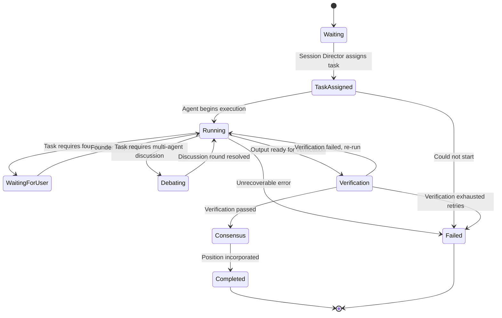

# State Machines

This document defines the two state machines that govern Shark Tank
AI. The **User Session State Machine** is fully implemented as of
Release 0.4 (see below). The **Agent Orchestration State Machine** is
defined here as a contract for future implementation — it does not
exist in code yet, and is a distinct concern from the User Session
State Machine (see the note at the end of section 1).

---

## 1. User Session State Machine

**Status: The twelve states below are implemented as
`models.enums.SessionPhase`.** They already drive
`ui/header.py`'s progress stepper and `ui/proposal.py`'s Session
Stage card. Every transition described below is implemented:
`orchestrator/orchestrator.py`'s Session Director
(`SharkTankOrchestrator`) drives every forward transition from
`Proposal Upload` onward, and the two UI-initiated transitions (Idle →
Proposal Uploaded via "Start Session", and any state → Idle via "End
Session", a full reset) still live in `ui/controls.py`, per rule 4
below (`architecture.md` → *Session Director*). `Market Research` and
`Negotiation` were added in Release 0.6. As of Release 0.7, both
`Verification` and `Consensus` run real logic
(`agents.verification_agent.VerificationAgent` /
`orchestrator.consensus_engine.ConsensusEngine`) instead of the
Release 0.4-0.6.1 deterministic pass-through. As of Release 0.8,
`Advanced Analysis` (`agents.financial_analyst.FinancialAnalyst`) runs
between Internal Deliberation and Verification -- see the states table
below and `docs/architecture.md` -> *Verification Agent* / *Consensus
Engine* / *Advanced Financial Analysis*.

### States

| State | `SessionPhase` value | Meaning |
|---|---|---|
| Idle | `idle` | No proposal yet. Starting state, and the state after a reset. |
| Proposal Upload | `proposal_uploaded` | A proposal has been provided and the session has been started. |
| Validation | `validation` | The Moderator validates the proposal and extracts structured fields (Release 0.6: a real LLM call). |
| Market Research | `market_research` | The Market Reality Research agent gathers and synthesizes external evidence (Release 0.6). |
| Question Round | `question_round` | The committee questions the founder; the founder may respond. Each Shark forms a preliminary evaluation, informed by the Market Reality Brief, just before asking its question. |
| Internal Deliberation | `internal_deliberation` | The committee discusses without the founder present. Each Shark forms its *final* evaluation here, now also informed by the founder's actual answers. |
| Advanced Analysis | `advanced_analysis` | `agents.financial_analyst.FinancialAnalyst` extracts financial facts (with provenance) from the proposal/founder answers and computes deterministic financial calculations, scenario valuations, and risk/upside factors (Release 0.8). Produces a `FinancialAnalysisResult`; never makes an investment decision itself. Runs *before* Verification so Verification can audit it (see `docs/architecture.md` -> Advanced Financial Analysis for why this deviates from that release's own suggested diagram order). A technical failure produces `analysis_status="unavailable"` (`AdvancedAnalysisFailed` event) rather than blocking the session. |
| Verification | `verification` | `agents.verification_agent.VerificationAgent` audits whether each Shark's final reasoning -- and, as of Release 0.8, the Advanced Financial Analysis itself -- is actually supported by the proposal, founder answers, and Market Reality Brief (Release 0.7). Produces a `VerificationResult`; never makes an investment decision itself. A technical failure produces `verification_status="unavailable"` (`VerificationFailed` event) rather than blocking the session. |
| Consensus | `consensus` | `orchestrator.consensus_engine.ConsensusEngine` reconciles the three Sharks' positions, the Advanced Financial Analysis, and the Verification findings into one formal `ConsensusResult` (Release 0.7, extended in Release 0.8 with business-quality/deal-quality/financial-health/growth/risk/scenario fields) — explicitly not a majority vote. A technical failure produces `recommendation="unavailable"` (`ConsensusFailed` event), distinct from a genuine `"insufficient_evidence"` conclusion. |
| Investment Decision | `investment_decision` | The Moderator narrates the committee's review, then each Shark announces its own real, independent offer (or declines) to the founder (Release 0.6) — unchanged by Verification/Consensus's addition (Release 0.7 spec Part 21). `InvestmentDecisionMade`'s `deal_status` now reflects the real `ConsensusResult.recommendation` (Release 0.7), not a fixed placeholder. |
| Negotiation | `negotiation` | The founder gets one counter-offer turn with each Shark who made an offer; that Shark accepts, rejects, or modifies (Release 0.6). |
| Session Complete | `session_complete` | The session has concluded; only Reset is available. As of Release 0.9, entering this state is preceded by `SharkTankOrchestrator._complete_session()` synchronously generating the session's `FounderFeedbackReport` via `agents.founder_feedback_agent.FounderFeedbackAgent` — deliberately **not** its own `SessionPhase` (see Rule 6 below and `architecture.md` -> Founder Feedback Report). A technical failure produces `report_status="unavailable"` (`FounderReportFailed` event) rather than blocking completion. |

There is also a **Reset** pseudo-transition, available from any state,
that returns the session to Idle. It is not itself a `SessionPhase`
value — it is the action implemented today as
`ui/session_state.reset_session_state()`, invoked by the "End Session"
control.

### Diagram

```mermaid
stateDiagram-v2
    [*] --> Idle

    Idle --> ProposalUpload: Proposal provided + Start Session (implemented)
    ProposalUpload --> Validation: Session Director begins validation (implemented; real Moderator LLM validation/extraction, with a deterministic fallback on provider failure — see architecture.md -> Moderator Agent)
    Validation --> MarketResearch: Proposal accepted (implemented)
    Validation --> Idle: Proposal rejected (implemented)
    MarketResearch --> QuestionRound: Research complete (implemented; real evidence-gathering with a fallback brief on failure — see architecture.md -> Market Reality Research)
    QuestionRound --> InternalDeliberation: Questioning complete (implemented)
    InternalDeliberation --> AdvancedAnalysis: Deliberation complete (implemented; Release 0.8 -- financial fact extraction and deterministic calculations, see architecture.md -> Advanced Financial Analysis)
    AdvancedAnalysis --> Verification: Analysis complete, or unavailable (implemented; Verification audits this analysis, per architecture.md -> Verification Agent)
    Verification --> Consensus: Verification always proceeds to Consensus (implemented; a real audit runs, but a failed/critical finding does not re-route the session -- see Rule 3)
    Verification --> InternalDeliberation: Verification failed, re-deliberate (planned; not implemented in Release 0.7/0.8 -- see Rule 3's documented deviation)
    Consensus --> InvestmentDecision: Consensus reached, or unavailable (implemented; real reconciliation via the Consensus Engine — see architecture.md -> Consensus Engine)
    InvestmentDecision --> Negotiation: At least one Shark made an offer (implemented)
    InvestmentDecision --> SessionComplete: No Shark made an offer (implemented; Founder Feedback Report generated en route, see Rule 6)
    Negotiation --> SessionComplete: Every interested Shark has received its one founder counter (implemented; Founder Feedback Report generated en route, see Rule 6)

    Idle --> Idle: Reset (implemented)
    ProposalUpload --> Idle: Reset (implemented)
    Validation --> Idle: Reset (implemented)
    MarketResearch --> Idle: Reset (implemented)
    QuestionRound --> Idle: Reset (implemented)
    InternalDeliberation --> Idle: Reset (implemented)
    AdvancedAnalysis --> Idle: Reset (implemented)
    Verification --> Idle: Reset (implemented)
    Consensus --> Idle: Reset (implemented)
    InvestmentDecision --> Idle: Reset (implemented)
    Negotiation --> Idle: Reset (implemented)
    SessionComplete --> Idle: Reset (implemented)

    SessionComplete --> [*]
```

### Rules

1. **Reset is universal.** Every state must accept a Reset transition
   back to Idle, with no confirmation step, per `architecture.md` and
   the original UI specification. This is already implemented via
   `reset_session_state()`, which clears all of `st.session_state`
   and reapplies defaults.
2. **Validation may reject.** A rejected proposal returns to Idle
   rather than advancing — the founder must resubmit, not "retry" from
   Validation. Implemented: `SharkTankOrchestrator._run_validation()`
   takes this path whenever `ModeratorAgent.validate_and_extract()`
   (a real LLM call as of Release 0.6) returns `accepted=False`, or its
   `fallback_validate()` does on provider failure (a trivial non-empty
   check — see `architecture.md` -> Moderator Agent).
5. **Negotiation only happens with interested Sharks.** A Shark who
   declined during Investment Decision is skipped entirely during
   Negotiation — only Sharks whose offer had `interested=True` get a
   founder counter-turn, in the fixed committee order (Conservative,
   Growth, Balanced). If no Shark made an offer, `InvestmentDecision`
   transitions directly to `SessionComplete`, skipping `Negotiation`
   altogether. Implemented via `orchestrator/negotiation_controller.py`
   -- a second, deliberately separate turn controller from
   `orchestrator/turn_controller.py`, since Negotiation's length is
   variable (zero to three turns) where the Question Round's is fixed.
3. **Verification may bounce back — still planned, not implemented in
   Release 0.7.** A failed/critical-finding verification returning to
   Internal Deliberation for one documented retry, rather than
   proceeding straight to Consensus regardless, remains a future
   release's scope. **Release 0.7 deliberately does not implement
   this path**, even though `VerificationAgent` is now real: adding a
   bounded retry loop would mean the Session Director gaining new
   loop/retry-counter control flow and at least one new state
   transition, which is a meaningfully larger architectural change
   than "add a real Verification Agent and Consensus Engine" — the
   Release 0.7 specification's own scope boundary (Part 3: "do not
   prematurely implement... a completely new UI architecture... a new
   orchestration framework") and its instruction to challenge, not
   silently implement, a requirement that would expand the
   architecture. Today, `VERIFICATION` always proceeds to `CONSENSUS`
   regardless of what the Verification Agent finds; severe findings
   instead flow *forward* into the Consensus Engine's reconciliation
   (e.g. as a `critical`-severity finding that legitimately drives the
   recommendation toward `do_not_invest` or `insufficient_evidence`),
   which is how this release surfaces a serious problem without a
   retry loop. See `docs/release_log.md` -> Release 0.7's documented
   deviation.
4. **Forward transitions are Session-Director-driven, not UI-driven.**
   Only Idle → Proposal Upload (via explicit user action) and any
   state → Idle (Reset) are triggered directly by UI button clicks.
   Every other forward transition is driven by the Session Director
   (`SharkTankOrchestrator`), never by a UI component setting
   `current_phase` directly — implemented and enforced today, not
   just a rule for future work.
6. **The Founder Feedback Report is not a `SessionPhase` — deliberate,
   as of Release 0.9.** Report generation is a finalization step
   folded into the existing `InvestmentDecision`/`Negotiation` →
   `SessionComplete` transition, not a new state the founder waits
   through turn-by-turn: by the time it runs, the simulation's
   interactive lifecycle is already over, there is no founder input to
   gate, and the Release 0.9 specification explicitly discourages
   adding state transitions for cosmetic reasons. Full Event Bus
   visibility is preserved via `FounderReportStarted`/
   `FounderReportCompleted`/`FounderReportFailed` (see
   `event_catalog.md`), fired synchronously inside
   `_complete_session()`, exactly like every other real
   agent/finalization step in this codebase (no threading/async is
   introduced).

---

## 2. Agent Orchestration State Machine

**Status: Fully planned. No code implements this today.** This state
machine governs the lifecycle of a *single agent's task* within a
session — for example, one Shark Agent evaluating a proposal, or the
Verification Agent checking a deliberation. Many instances of this
state machine run per User Session (one per agent, per phase that
needs them).

### States

| State | Meaning |
|---|---|
| Waiting | The agent has been instantiated but has no task yet. |
| Task Assigned | The Session Director has assigned a specific task (e.g., "evaluate this proposal"). |
| Running | The agent is actively executing (calling its provider, using skills/tools). |
| Waiting for User | The agent's task requires founder input before it can continue (used during Question Round). |
| Debating | The agent is in a multi-agent discussion with other agents (Internal Deliberation). |
| Verification | The agent's output is being checked by the Verification Agent. |
| Consensus | The agent's position is being incorporated by the Consensus Engine. |
| Completed | The agent's task finished successfully. |
| Failed | The agent's task could not complete (provider error, invalid output, timeout). |

### Diagram



### Rules

1. **`Failed` is terminal for that task, not for the session.** An
   agent task failing must be handled by the Session Director (e.g.,
   proceed without that agent's input, or fail the whole session
   explicitly) — it must never silently stall the User Session State
   Machine. How the Session Director responds to a `Failed` agent task
   is itself a Session-Director-level decision, not this state
   machine's concern.
2. **`Waiting for User` only applies during Question Round.** An agent
   task must not enter `Waiting for User` during Internal Deliberation
   or Verification — those phases are explicitly founder-absent per
   `architecture.md`'s Project Vision.
3. **Retries are bounded.** `Verification → Running` (re-run) and the
   User Session State Machine's `Verification → Internal Deliberation`
   both represent retry paths. A future implementation must cap the
   number of retries and transition to `Failed` (agent level) or back
   to `Idle` (session level) rather than looping indefinitely — the
   exact cap is an implementation detail for the release that builds
   this, not specified here.
4. **One Agent Orchestration State Machine instance per agent task,
   not per agent.** A single Shark Agent may run through
   Waiting → ... → Completed multiple times across one session (once
   per Question Round exchange, once for Internal Deliberation, etc.)
   — each is a separate instance of this state machine, not a shared
   one.

---

## How the Two State Machines Relate

The User Session State Machine is the outer, session-wide state. The
Agent Orchestration State Machine runs *inside* specific User Session
states — primarily Question Round, Internal Deliberation,
Verification, and Consensus. The Session Director (planned; see
`architecture.md`) is responsible for both: advancing the User Session
State Machine, and spawning/tracking Agent Orchestration State Machine
instances for each agent task that phase requires.
