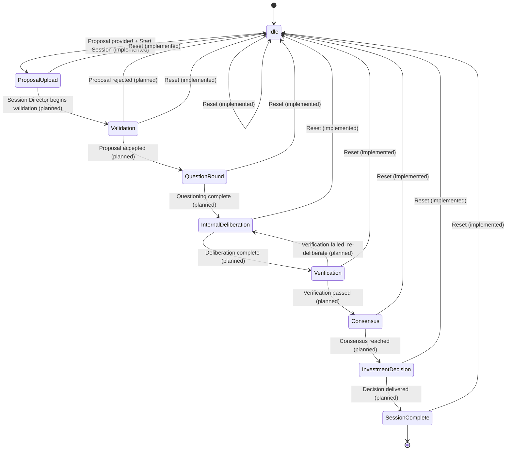
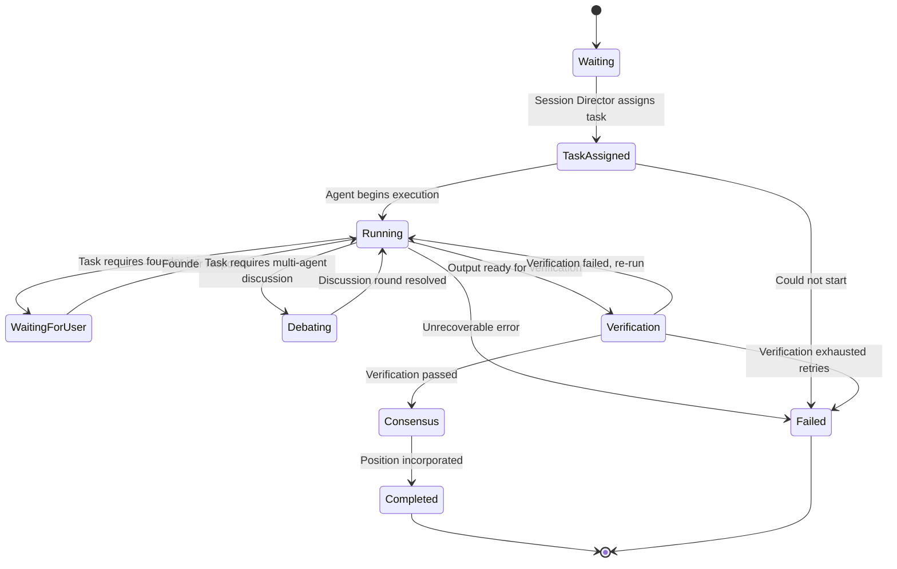

# State Machines

This document defines the two state machines that govern Shark Tank
AI. The **User Session State Machine** is partially implemented today
(see below). The **Agent Orchestration State Machine** is defined here
for the first time as a contract for future implementation — it does
not exist in code yet.

---

## 1. User Session State Machine

**Status: The nine states below are implemented as
`models.enums.SessionPhase`.** They already drive
`ui/header.py`'s progress stepper and `ui/proposal.py`'s Session
Stage card. The transitions between them — described below — are
**only partially implemented**: today, only Idle → Proposal Uploaded
(via "Start Session") and any state → Idle (via "End Session", a full
reset) exist in code, both in `ui/controls.py`. Every other transition
is planned, to be driven by the future Session Director
(`architecture.md` → *Session Director*).

### States

| State | `SessionPhase` value | Meaning |
|---|---|---|
| Idle | `idle` | No proposal yet. Starting state, and the state after a reset. |
| Proposal Upload | `proposal_uploaded` | A proposal has been provided and the session has been started. |
| Validation | `validation` | The committee is validating the proposal is well-formed and answerable. |
| Question Round | `question_round` | The committee questions the founder; the founder may respond. |
| Internal Deliberation | `internal_deliberation` | The committee discusses without the founder present. |
| Verification | `verification` | The Verification Agent checks the deliberation's soundness. |
| Consensus | `consensus` | The Consensus Engine aggregates positions into one decision. |
| Investment Decision | `investment_decision` | The decision is delivered to the founder. |
| Session Complete | `session_complete` | The session has concluded; only Reset is available. |

There is also a **Reset** pseudo-transition, available from any state,
that returns the session to Idle. It is not itself a `SessionPhase`
value — it is the action implemented today as
`ui/session_state.reset_session_state()`, invoked by the "End Session"
control.

### Diagram

### Rules

1. **Reset is universal.** Every state must accept a Reset transition
   back to Idle, with no confirmation step, per `architecture.md` and
   the original UI specification. This is already implemented via
   `reset_session_state()`, which clears all of `st.session_state`
   and reapplies defaults.
2. **Validation may reject.** A rejected proposal returns to Idle
   rather than advancing — the founder must resubmit, not "retry" from
   Validation. (Planned; not implemented.)
3. **Verification may bounce back.** A failed verification returns to
   Internal Deliberation rather than failing the whole session — the
   committee gets one documented retry path, not silent failure.
   (Planned; not implemented.)
4. **Forward transitions are Session-Director-driven, not UI-driven.**
   Only Idle → Proposal Upload (via explicit user action) and any
   state → Idle (Reset) are triggered directly by UI button clicks.
   Every other forward transition must be driven by the Session
   Director reacting to backend events (see `event_catalog.md`), never
   by a UI component setting `current_phase` directly. This is a
   binding rule for future implementation, not just current practice.

---

## 2. Agent Orchestration State Machine

**Status: Fully planned. No code implements this today.** This state
machine governs the lifecycle of a *single agent's task* within a
session — for example, one Shark Agent evaluating a proposal, or the
Verification Agent checking a deliberation. Many instances of this
state machine run per User Session (one per agent, per phase that
needs them).

### States

| State | Meaning |
|---|---|
| Waiting | The agent has been instantiated but has no task yet. |
| Task Assigned | The Session Director has assigned a specific task (e.g., "evaluate this proposal"). |
| Running | The agent is actively executing (calling its provider, using skills/tools). |
| Waiting for User | The agent's task requires founder input before it can continue (used during Question Round). |
| Debating | The agent is in a multi-agent discussion with other agents (Internal Deliberation). |
| Verification | The agent's output is being checked by the Verification Agent. |
| Consensus | The agent's position is being incorporated by the Consensus Engine. |
| Completed | The agent's task finished successfully. |
| Failed | The agent's task could not complete (provider error, invalid output, timeout). |

### Diagram

### Rules

1. **`Failed` is terminal for that task, not for the session.** An
   agent task failing must be handled by the Session Director (e.g.,
   proceed without that agent's input, or fail the whole session
   explicitly) — it must never silently stall the User Session State
   Machine. How the Session Director responds to a `Failed` agent task
   is itself a Session-Director-level decision, not this state
   machine's concern.
2. **`Waiting for User` only applies during Question Round.** An agent
   task must not enter `Waiting for User` during Internal Deliberation
   or Verification — those phases are explicitly founder-absent per
   `architecture.md`'s Project Vision.
3. **Retries are bounded.** `Verification → Running` (re-run) and the
   User Session State Machine's `Verification → Internal Deliberation`
   both represent retry paths. A future implementation must cap the
   number of retries and transition to `Failed` (agent level) or back
   to `Idle` (session level) rather than looping indefinitely — the
   exact cap is an implementation detail for the release that builds
   this, not specified here.
4. **One Agent Orchestration State Machine instance per agent task,
   not per agent.** A single Shark Agent may run through
   Waiting → ... → Completed multiple times across one session (once
   per Question Round exchange, once for Internal Deliberation, etc.)
   — each is a separate instance of this state machine, not a shared
   one.

---

## How the Two State Machines Relate

The User Session State Machine is the outer, session-wide state. The
Agent Orchestration State Machine runs *inside* specific User Session
states — primarily Question Round, Internal Deliberation,
Verification, and Consensus. The Session Director (planned; see
`architecture.md`) is responsible for both: advancing the User Session
State Machine, and spawning/tracking Agent Orchestration State Machine
instances for each agent task that phase requires.
